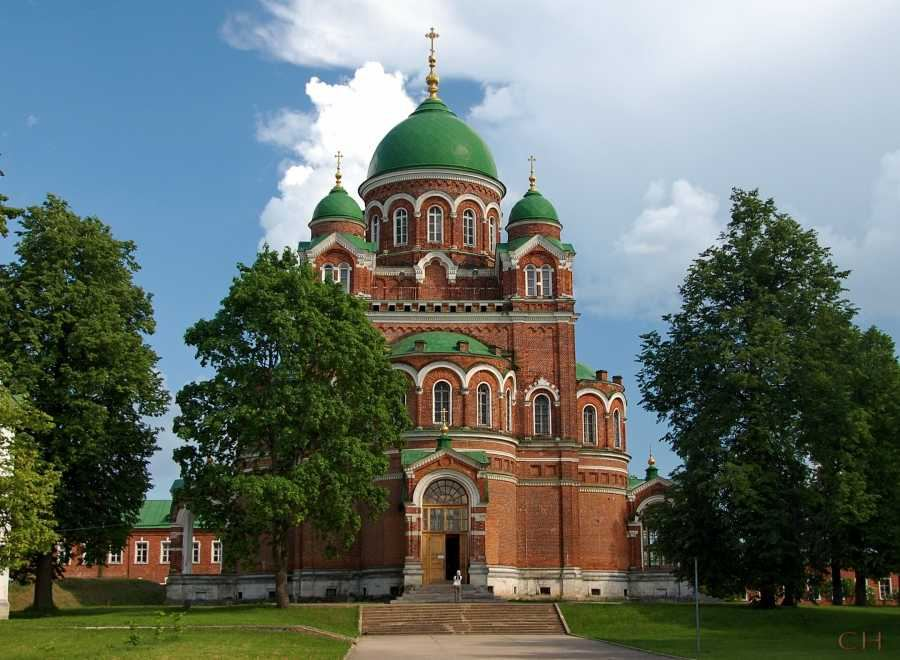

<link rel="stylesheet" href="../assets-custom/css/style-markdown.css">

	

		

            Бородино и Можайск
        

		

			

                
                
На велосипеде, 39 км.

            

            

                
                1 день
            

		

	

[📍GPX трек borodino-mozshaysk.gpx](borodino-mozshaysk.gpx)

**🚴‍♂️ Осенняя велосипедная прогулка** по историческому полю Бородино и старому городу Можайск, на западе от Москвы

Мы начнем наше путешествие с Белорусского вокзала в Москве и отправимся в город Можайск на электричке. Путь займет всего 2 часа, и мы окажемся в одном из самых исторически значимых городов Подмосковья.

Наш маршрут пройдет по живописным асфальтированным дорогам на протяжении 32 км, без крутых подъемов и с минимальным движением автомобилей, что сделает поездку максимально комфортной и безопасной.

В пути мы посетим два монастыря, исторический музей «Поле Бородино», художественный дом-музей и множество памятников, посвященных событиям 1812 года, когда великая армия Наполеона вторглась на русскую землю.

2. Спасо-Бородинский монастырь — один из символов поля битвы при Бородино, основанный в честь победы над французами в 1812 году. Здесь мы сможем почувствовать атмосферу эпохи и увидеть памятные места с историческими реликвиями.
Спасо-Бородинский монастырь
2.	Музей Бородинского поля — знаменитый музей, который расскажет об одной из самых известных битв в истории России. В его экспозициях можно увидеть картины, оружие, военную форму и другие артефакты тех времен.
Музей Бородинского поля

Кроме того, в ходе поездки мы посетим Лысецкий монастырь, который расположен в живописном месте на берегу Москвы-реки. Здесь также стоит прогуляться и насладиться тишиной и природой.

Наш путь будет проходить вдоль Москвы-реки, что добавит прогулке красоты и умиротворения. Легкие холмы на маршруте будут напоминать нам о живописных просторах Звенигорода.

Не забудем заглянуть в Кремль в Можайске, старинную крепость, которая была свидетелем множества исторических событий, и пройтись по уютным улочкам этого древнего города.

Это будет незабываемая поездка, наполненная историей и красотой природы, с возможностью проникнуться атмосферой славных побед и вековых традиций России.

Погода в это время года обещает быть идеальной для такой велосипедной прогулки — свежий воздух, золотые оттенки осени и тихие дорожки, ведущие через исторические места.

Ссылки на достопримечательности:
•	Спасо-Бородинский монастырь:
https://www.google.com/maps?cid=8673081409686561714
•	Музей Бородинского поля:
https://www.google.com/maps?cid=15129523130775305532
•	Лысецкий монастырь:
https://maps.google.com/?cid=1234567890  (пример)
•	Кремль в Можайске:
https://maps.google.com/?cid=9876543210  (пример)

Подготовьтесь к увлекательному путешествию по следам исторических событий и насладитесь красотой русской природы!

<link href="https://api.mapbox.com/mapbox-gl-js/v3.10.0/mapbox-gl.css" rel="stylesheet">

