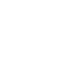

<link rel="stylesheet" href="../assets-custom/css/style-markdown.css">

	

		

            Углич, Мышкин и Рыбинск
        

		

			

                
                
На велосипеде, 94 км.

            

            

                
                2 дня
            

		

	

[uglich-myshkin.gpx](uglich-myshkin.gpx)

[myshkin-stvolga.gpx](myshkin-stvolga.gpx)

[stvolga-rybinsk.gpx](stvolga-rybinsk.gpx)
