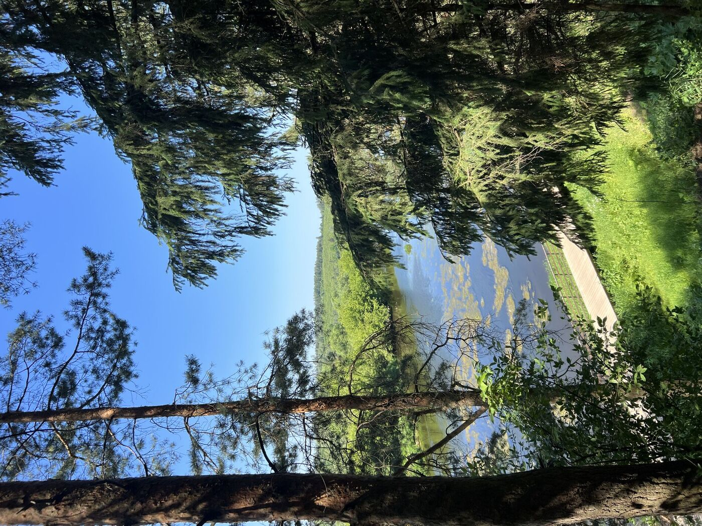
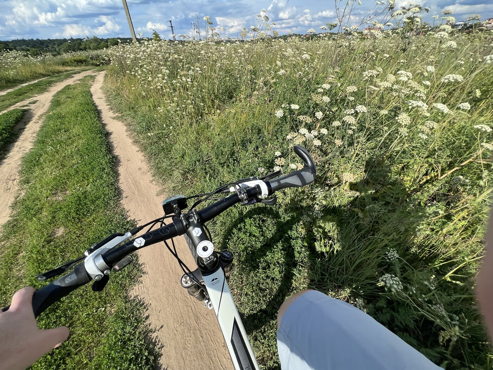
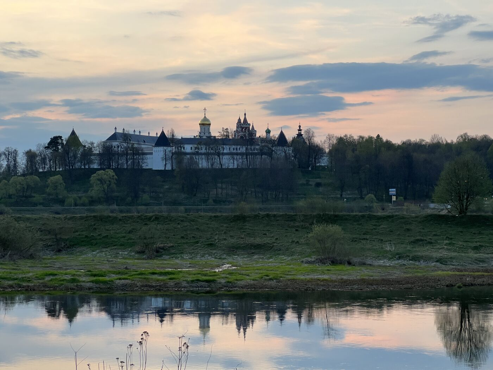

<link rel="stylesheet" href="../assets-custom/css/style-markdown.css">

	

		

            Дорохово - Звенигород
        

		

			

                
                
На велосипеде, 80 км.

            

            

                
                1 день
            

		

	

[📍GPX трек dorohovo-zvenigorod.gpx](dorohovo-zvenigorod.gpx)

## От станции Дорохово по дороге к реке

Путешествие от Дорохово до Звенигорода будет одним из самых длинных маршрутов на один день в моей коллекции, оно позволит посетить почти все самые интеренсые подвисные мосты через Москву-реку.

Путь начинается на станции Дорохово, часах езды на электричке от Москвы. Доехать можно на любой электри чке в сторону Можайска, Бородино и одноименной станциии. Электрички ходят часто, почти каждый час бывает в нашу сторону от Белорусского вокзала.

На станции Дорохово есть несколько удобных успермаркетов, в которых можно запастись водой и перекусом.
Дорога наша будет пролегать вначале по местной проезжей дороге, по которой мы приблизимся к реке.

## Устью реки Рузы и санаторий Дорохово

В непосредственной близи от впадения реки Рузы в Москву-реку расположен длинный подвесной мост, изящно соединяющий зеленые берега реки, и с которого открывается прекрасный вид на реку. 

Сразу же на другой стороне моста мы попадаем на территорию санатория Дорохово. Здесь придется подняться по крутой высокой лестнице.

## От Старой Рузы
Взобравшись по ней мы оказываемся на небольшой смотровой площадке, с которой из-за высоких старых сосен вдали простирается русло реки Рузы. По лессистой теорритории санатория можно проехаться, посмотрев старые советские корпуса, окруженные высокими соснами и липами. А потом сразу же выйдя за ворота попасть на оживленную дорогу в Старой Рузе. 

Заезжать в этот город или поселок мы не будем. Направимся по течению Москвы-реки к следующему подвесному мосту.

Далее путь пролегает через тихие дороги в сторону Старой Рузы, некогда значимого торгового и административного центра. По пути встречаются фрагменты старинных зданий и усадеб, напоминающих о дореволюционном прошлом этих мест.

## Мосты подвесные на Марсе и отдельный старый ЖД мост

Проезжая рядом с Ожигово, не забудем заехать посомтреть на местный подвесной мост. С него открываются потрясающие виды на речную долину и окрестные холмы.

По здешним отдаленным окрестностям продолжим свой путь. Проезжая по дороге в стороне увидим высоки каменный мост с еще оставшимися шпалами. Еще ндавно здесь проходила отдельня ветка в сторону песчаного карьера. Но пару десятилетйи, она как уже заброшена, а с высокого моста открываются восхитительные виды.

Обычно, в другой поездке от плтформы Театральной наш маршрут непосредственнно проходит по этому бывшеум ЖД мосту. В этот раз на него можно заехать по своему усмотрению, или проехать далее к новому подвесному мосту.

Немного в стороне от дороги раскинулся желтый подвесной мост на Марс. Он мало используется, соседствуя с автомобильным рядом. По нему здорово пробежаться, пытаясь не сильно раскачивать длинные тросы моста.

Когда-то раньше можно было проехаться по заросшим тропинкам берега реки напротив Тучково, но в последние годы частные базы отдыха построили заборы, что стало сложнее сделать. Любители приключений могу проверить возможность открытого проезда.

Но а я рекоменду вернуться на болльшу асфальтовую дорогу и немного проехать в горку до сьезда на проезжую дорогу. Здесь стоит будть осторожным, длинномерные грузовики с щебнем с карьера здесь гоняют, не замечая других участников движения.

### К Тучково

Взобравшись на возвышенность потом проедем средь полей и полесков, на встречу прекрасному виду с возвышенности. По весне здесь цветут одуванчики, покрывая поле желтым разноцветным ковром. 

С ветерком спустимся к поселку, не забыв пропустить нужный заезад к дачным домам. И почти сразу же мы выйдем к реке с перекинутым небольшим снова подвесным мостиком.

В поселке имеется продуктовый магазин, в котором можно что-то купить по дороге, т.к. следующий будет через ?? км. уже в деревне Волково.

###  Начало веломаршрута и усадьба Любвино на холме

По пути передем дорогу и свернем к дачным участкам, за которыми на солнечной зеленой поляне на берегу начинается вломаршрут Вело2Руза. Он стал проектироватсья недавно, в основном он размечен и сделаны местами удобные мостики. 

А на холме за густыми деервяьми прячется старая усадьба Любвино. Сегодня она полуразрушена, но еще совсем недавно в ней располагался санаторий, снимались фильмы, например, по роману Солженицына "В круге первом", здесь когда то бывали в гостях Шаляпин и Коровин. 

Отправляемся по тенистым тропинккам веломаршрута 

## Полушкино и каменоломни

Проезжая по тенистым тропинкам веломаршрута по обоим сторонам холмистых берегов можем замечать небольшие скалистые участки. Это известные исторические Полушкинские каменоломни, из которых в своё время добывался камень для строительства Московского Кремля. Сейчас здесь уже нет промысла, а на откртых скалах проходят детские соревнования по туризму, а также альпинисты часто приезжают для тренировок. 

Уникальные геологические образования и живописные виды привлекают любителей природы и спорта.

По пути можно заехать к роднику за вкусной свежей водой. (LOCATION)

## Васильевское с подвесным мостом

Проехав уже значительное расстояние вдоль живописного берега Москвы-реки мы неожиданно увидим широкий раскинывшийся подвесной мост ведущий в Васильевское. 

Васильевское по своему уникально, оно стало метом в котором вырос выдющийся русский ?? Александр Герцин в старой усадьбе на холме.

> "Я мало видал мест изящнее Васильевского… Вид из нового дома обнимал верст пятнадцать кругом: озера нив, усадьбы с белеющими церквами, леса разных цветов делали полукруглую раму, и через все — голубая тесьма Москва-реки."

Его детсво прошло на этих берегах реки, он очень люил их и возвращался сюда почти каждое лето. После душного московского дома, где даже днём не открывали шторы, деревня была как глоток воздуха:

> «Я страстно любил деревенскую жизнь… Всё это было так ново, выросшему за каменными стенами…»

Здесь, среди ив и песка, он впервые почувствовал истинную свободу. Он каждый год он приезжал с  книгами: сначала — сказки, потом — Шиллер и Плутарх. 

> «Деревней можно было мерить не только рост, но и мысли», — писал он.

> «Из моей комнаты в мезонине — кругом деревни, церкви, леса, и через всё — голубая лента Москвы-реки…»

Эти пейзажи остались в нём навсегда, даже когда он оказался в Лондоне, в Париже, в изгнании:

> «Ничто не изгладило из моей памяти запахов и красот Васильевского — ни Сорренто, ни Альпы, ни Франция…»

Позже он вернётся — и почувствует, как всё поменялось:

> «Только при этой реке, при этих аллеях я могу ясно вернуться в то время, когда всё было зелено, и всё — впереди».

Сегодня на территории усадьбы раполагается санаторий президентской службы. Еще недавно можно было пройти прогуляться среди вековых деревьев, увидеть прекрасный главный дом. Но сегодня без санаторного билета мы можем любоваться жтой усадьбой в нашем воображении сквозь толщи деревьев где-то там на холме.

## В сторону Волково и карьера болота Симы

Наш путь продолжается.

В Агафоново мы можем выехать на асфальтовую дорого совершенно мало автомобильную и спокойную, или продолжать поездку по крутым дорожкам вблизи реки.

Подьехав к Волково и Рязани можно заглянуть в супермаркет за водой и продуктами.

На перекрестке мы можем на час дополнить наше путешетсвием поездкой к болоту карьера Сима. это заповедное озеро вглубине старого леаса. Дорога к нему будет извилистой по хвойным тропам, а на самом болоте деревянные мостики, приводящие к воде. Здесь по-настоящему тихо, можно услышать только ветер и пение птиц. Это идеальное место для отдыха, пикника и купания.

Дорога туда и обратно в 3 км. займет около часу. Очень рекомендую совершить туда путешествие.

## В сторону Каринского моста и вдоль берега биостанции МГУ

Совсем недалеко мы подьезжаем к еще одному подвесному мосту, это последний такйо мост на нашем пути и на Москве-реке ниже по течению. Он самый длинный из всех, он чатсо попадал в фильмы.

Дальнейший наш путь проходит вдоль берега Москвы-реки, напротив биостанции МГУ, где проходят практики студенты биофака. Здесь можно найти родник с чистой водой, устроить привал и даже искупаться в теплую погоду.

## Послу Луцыно

На пути попадается мост Большого кольца Московской железной дороги (БМО), с которого открывается интересный вид на проходящие поезда или помахать им рукой.
 
С высокого бугорка можно встречать яркий закат солнца.

## Старый город Звенигород и Савинский монасятрь на другом берегу в лучах заходящего солнца.

Проезжая по пыльной полевой дороге, вдалеке на том берегу показываются купола знамениторго Савинского монастыря. В его куполах ярко отражются лучи скрывшегося солнца этого яркого жаркого дня.
Вечернаяя прохлада подступает, дымка растовряется над рекой в закатных алых красках неба. 

Вот и показывается на другой стороне в толще деревьев купол Успенского храма на городке. 
Его совсем недавно отреставрировали и сегодня он предстает перед нами во всей своей красе. 
Важно не пропустить его, спеша на вечернюю электричку от станции.

Заехать в сам город Звенигород и посетить его достопримечательности я рекомендую в другие наши путешествия. А сегодня стоит неспешна насладиться догорающим закатом. 

Последний участок маршрута ведёт через поля и леса, с возможностью сделать остановку напротив Саввино-Сторожевского монастыря, и далее — в сам Звенигород. Здесь можно посетить кофейню ДОМ или пекарню Хлебник, насладиться вкусной выпечкой и ароматным кофе, завершив день на приятной ноте.

#  На электричке в Москву

От станции Звенигород обычно отходят каждый час электрички в сторону Москвы, время в пути занимает 1 час и 20 минут. Это прекрасное время, когда можно будет перекусить после насыщеного пути и вспомнить лучшие моменты нашего путешествия.

## Васьельевское и санаторий им. Герцина

## Гигерево

## Биостанции и берег Москвы-реки

### Саввинский монастырь. Вид издалека

### Городок и Успенский собор. Вид издалека

## К станции Звенигород

<link href="https://api.mapbox.com/mapbox-gl-js/v3.10.0/mapbox-gl.css" rel="stylesheet">

