<link rel="stylesheet" href="../assets-custom/css/style-markdown.css">

	

		

            Дютково в окрестностях Звенигорода
        

		

			

                
                Пешком
            

            

                
                1 день
            

		

	

## Звенигород. От Станции к городу

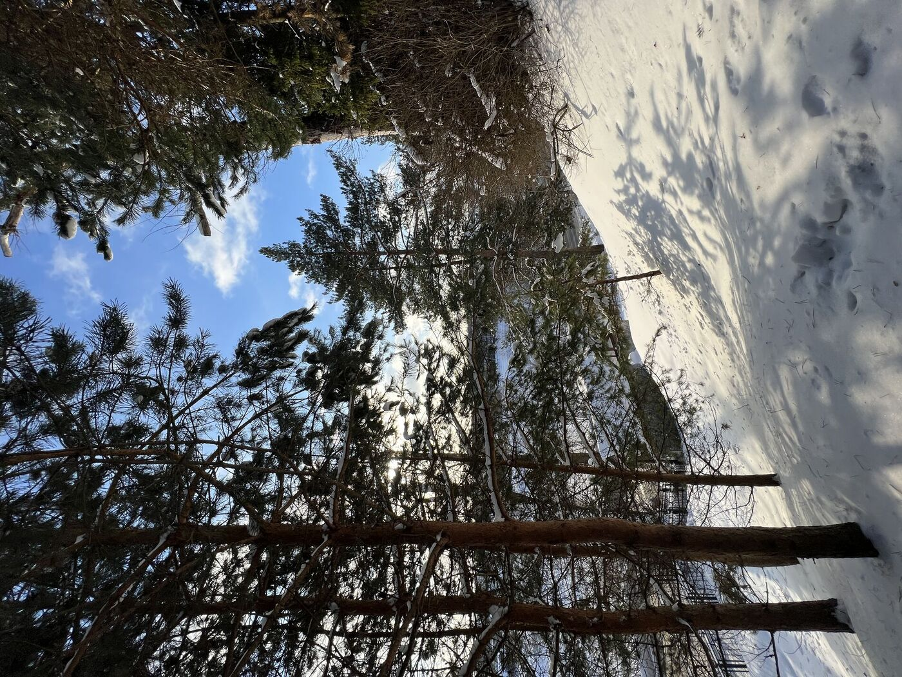

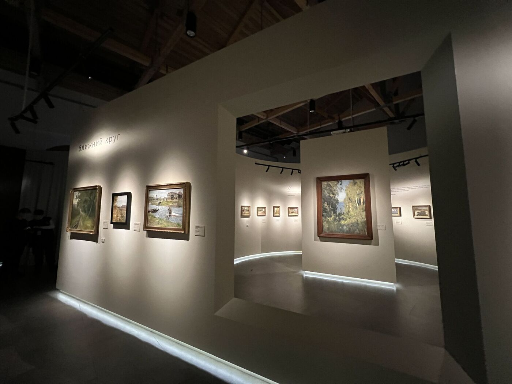

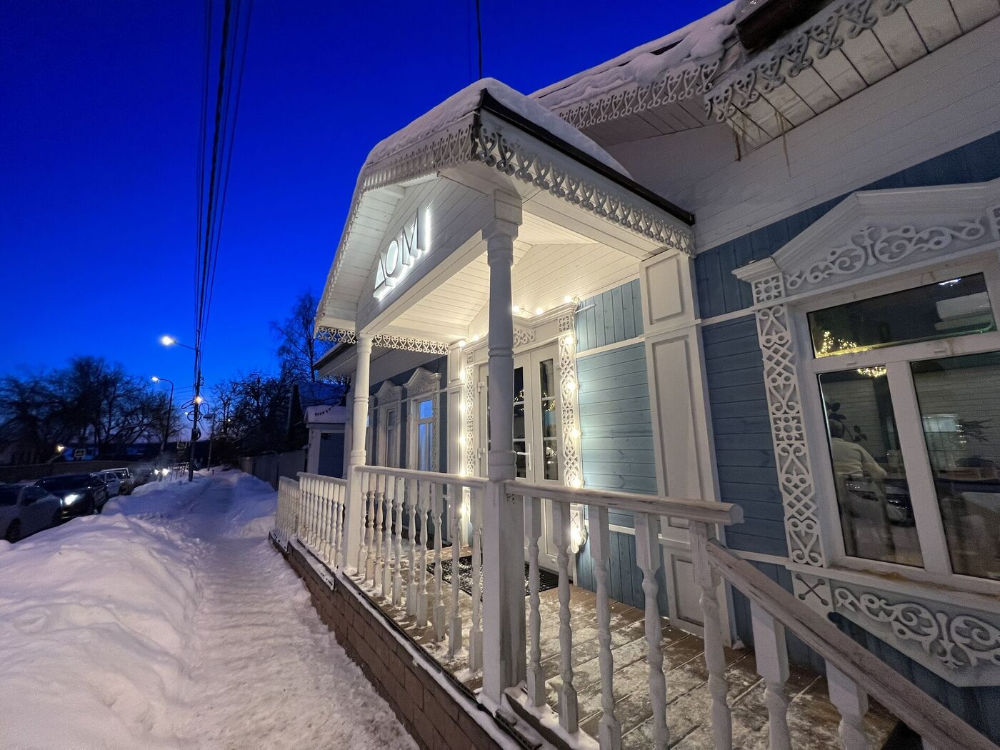

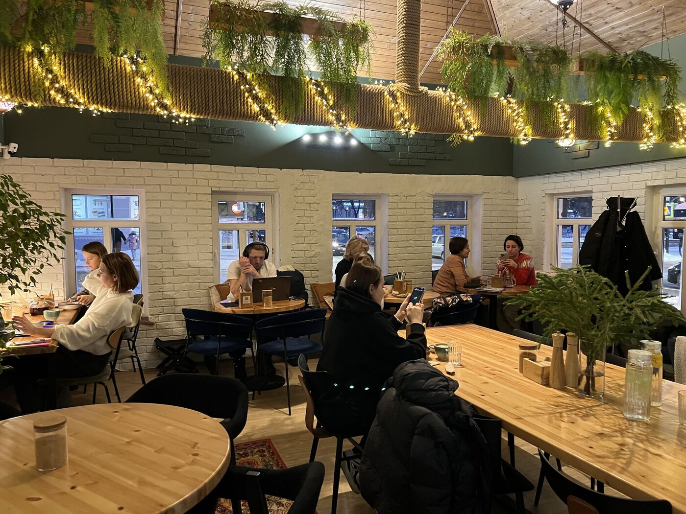

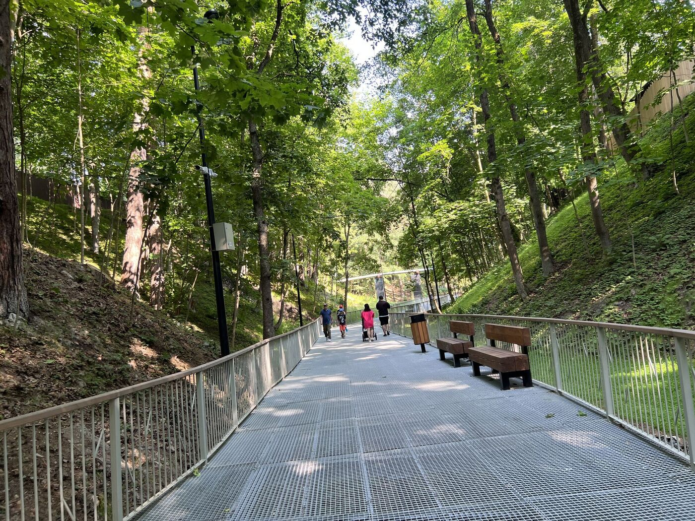

## Выставочный центр - Манеж

Манеж в Звенигороде — современное культурное пространство, объединяющее искусство, историю и комфорт. Он включает два зала: один для постоянной экспозиции, рассказывающей об истории города, и другой — для временных выставок, проводимых в сотрудничестве с Русским музеем.

Здесь прошли выставки, такие как «Вокруг Левитана» и «Преображённая природа», с произведениями известных художников, включая Айвазовского, Саврасова, Куинджи, Репина, Поленова, Коровина, Грабаря и Васнецова.

Также в манеже работают уютный кафетерий и магазин, где можно найти книги о Звенигороде, русской художественной культуре и оригинальные сувениры.

Манеж стал важной культурной точкой города, где искусство и история переплетаются с современными удобствами.

## Малиновый овраг

Малиновый овраг в Звенигороде, когда-то носивший название Америка, — живописная тропа, ведущая через крутые холмы, где в жаркие дни всегда прохладно. Она выводит к холмистому Городку и Успенскому собору, создавая прекрасное место для прогулок на свежем воздухе.

На пути к вершине оврага можно увидеть дуб Чехова, под которым писатель любил отдыхать, а также дом-больницу, где он работал. Эти места вдохновляли Чехова на написание множества рассказов, сделав их неотъемлемой частью литературного наследия Звенигорода.

## Городок и Успенский собор

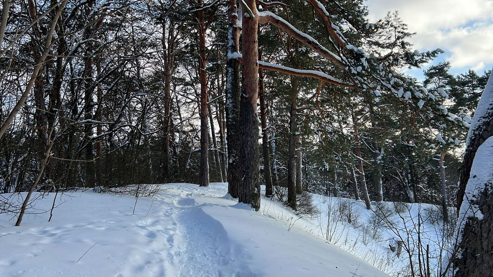

## Саввино-Сторожевский Монастырь

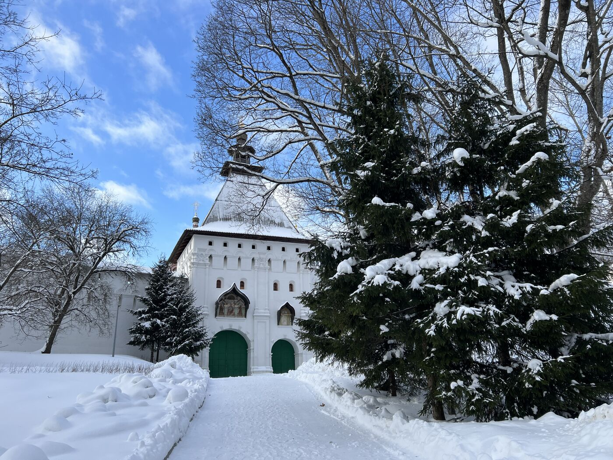

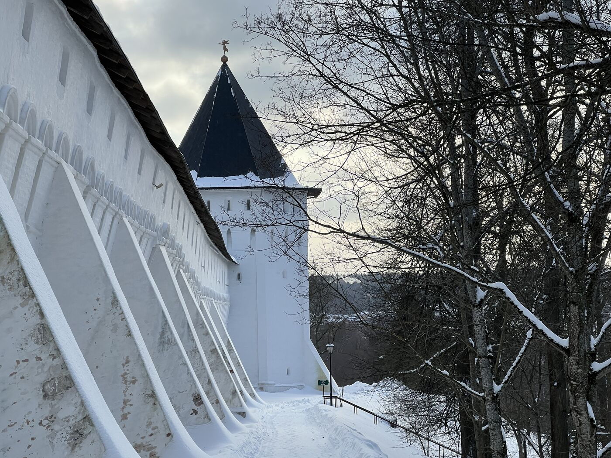

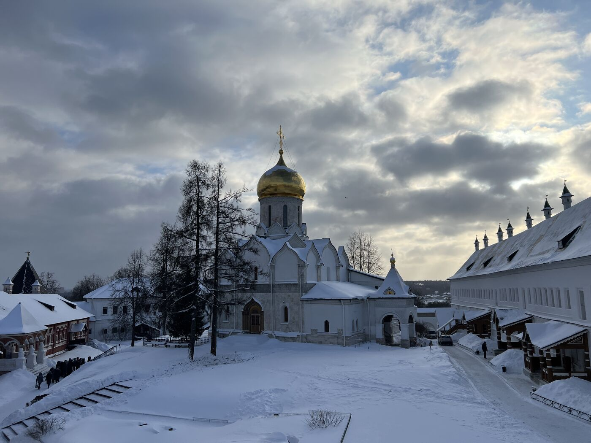

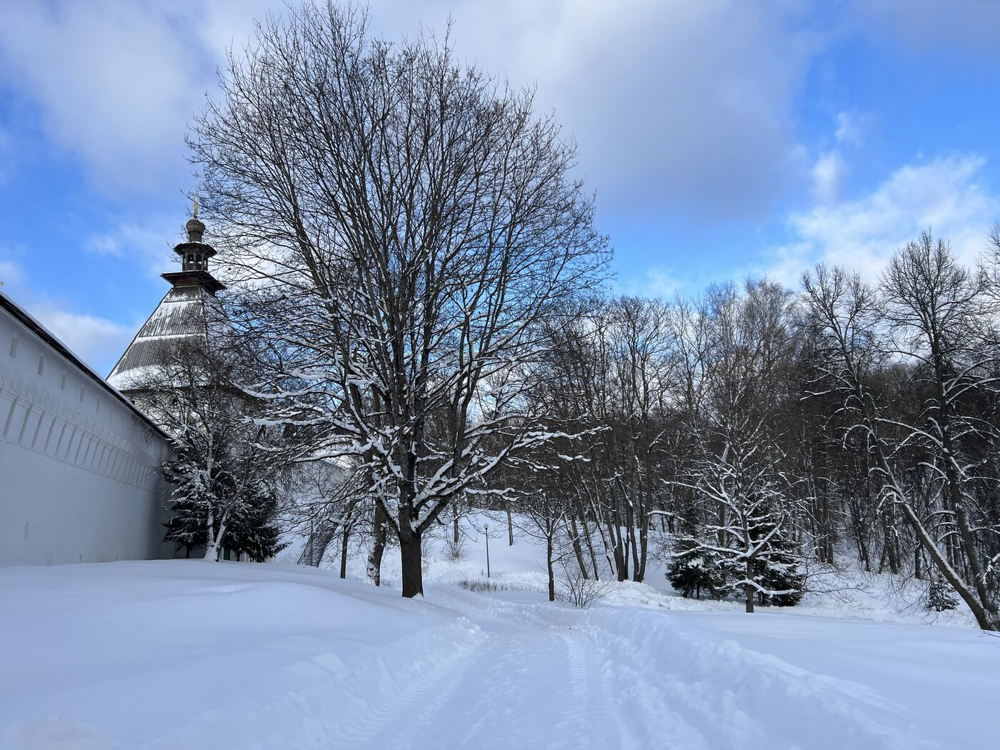

## Саввинский скит и Дютьково

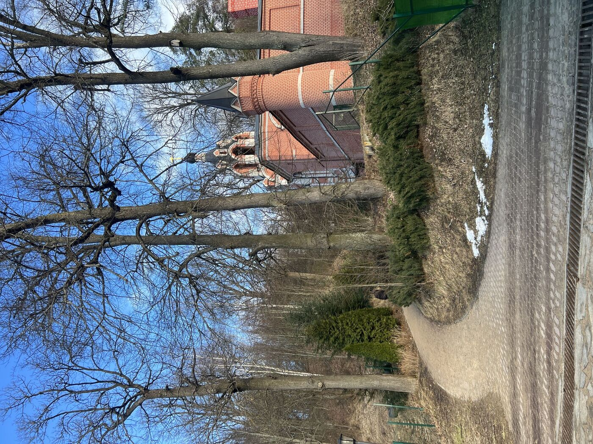

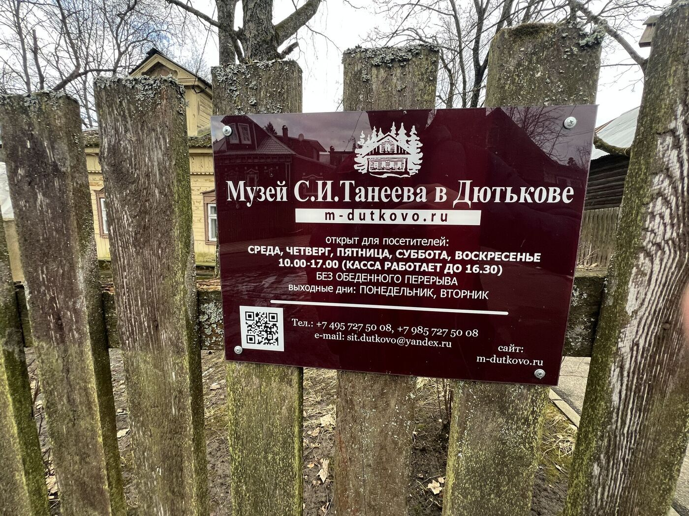

<link href="https://api.mapbox.com/mapbox-gl-js/v3.10.0/mapbox-gl.css" rel="stylesheet">

