<link rel="stylesheet" href="../assets-custom/css/style-markdown.css">

	

		

            Марс на Театральной - Звенигород
        

		

			

                
                
На велосипеде, 65 км.

            

            

                
                1 день
            

		

	

[📍GPX трек mars-zvenigorod.gpx](mars-zvenigorod.gpx)

## От платформы Театральной

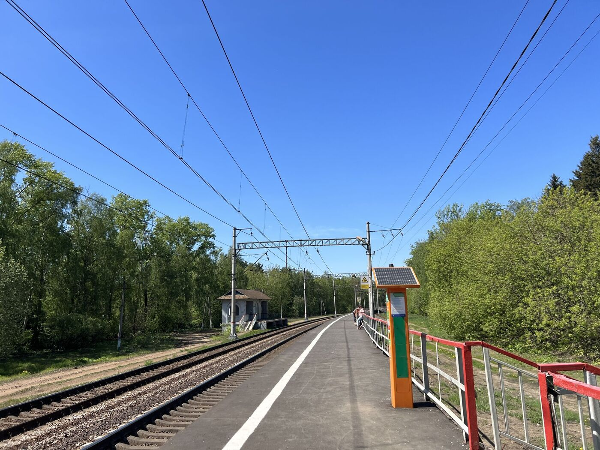

Платформа Театральная, расположенная в Рузском городском округе Московской области, является отправной точкой для увлекательного веломаршрута, пролегающего по живописным берегам реки Москвы. Маршрут длиной около 80 км соединяет платформу Театральная и станцию Тучково, предлагая велосипедистам насладиться природными красотами и историческими достопримечательностями региона.

## Платформа Театральная

В небольшом поселке у платформы Театральная есть уютный продуктовый магазин, где можно приобрести воду, свежую выпечку и необходимые припасы перед началом путешествия.

Дорога от платформы проходит среди дачных домиков, открывая вид на живописные окрестности. Спуск к Москве-реке ведет по тихой лесной дороге, где воздух наполнен ароматами хвойных деревьев и свежескошенной травы.

## Старый железнодорожный мост на Марсе

Первый важный пункт маршрута — старый железнодорожный мост в районе Марса. С него открывается захватывающий вид на широкую долину Москвы-реки. Особенно красиво здесь в утренние часы, когда солнце мягко подсвечивает водную гладь, создавая игру бликов на поверхности.

### Ожигово: подвесной мост

От моста на Марсе можно сделать небольшой круговой заезд в сторону деревни Ожигово, чтобы увидеть ещё один подвесной мост. Это уединённое место, где тишина природы и плавное течение реки создают атмосферу умиротворения.

### Подвесной мост в Поречье

Вернувшись к основному маршруту, стоит посетить ещё один мост — жёлтый подвесной мост на Марсе, ведущий в Поречье. Этот мост особенно эффектно смотрится осенью, когда окружающий лес вспыхивает золотыми и багряными красками.

### Москворецкий заказник и подвесной мост в Игнатьево

Продвигаясь дальше, маршрут слегка обходит Москворецкий заказник, богатый разнообразными ландшафтами — от заливных лугов до густых смешанных лесов. Здесь часто можно встретить аистов, цапель и других редких птиц.

Вскоре путь выходит к подвесному мосту через Москву-реку в Игнатьево. Это место идеально подходит для небольшой остановки, чтобы сделать несколько фотографий и насладиться тишиной.

### Усадьба Любвино и начало веломаршрута Вело2Руза

После пересечения реки маршрут ведёт к началу знаменитого веломаршрута Вело2Руза. Точка старта расположена недалеко от старинной усадьбы Любвино, окружённой тенистыми аллеями и остатками старого парка.

Усадьба Любвино, возведенная в начале XX века для Герасима Хлудова, поражала своей архитектурой и великолепным парком. Здесь бывали такие известные личности, как Федор Шаляпин и Константин Коровин. После революции усадьба стала санаторием, а позже — местом для съемок фильма «В круге первом». Несмотря на разрушения, с её территории открывается удивительный вид на Москву-реку. Это место также является началом живописного веломаршрута Тучково-Волково, популярного среди любителей активного отдыха.

## Полушкино: каменоломни для Московского Кремля

Проезжая через Полушкино, стоит остановиться у знаменитых каменоломен. Именно отсюда добывался камень для строительства Московского Кремля. Сегодня в подземных лабиринтах часто проходят соревнования по спортивному туризму, а сам маршрут через этот участок проходит по живописной лесной дороге.

Полушкинские каменоломни, расположенные вдоль веломаршрута Тучково-Волково, являются не только природной, но и исторической ценностью. Известняк, добываемый здесь, использовался для строительства таких знаковых объектов, как Кремль, а также для возведения храмов, доставляясь на баржах по Москве-реке. Сегодня каменоломни — это место, где проходят детские соревнования по туризму, а также тренировки альпинистов. Уникальные природные ландшафты и живописные виды делают это место популярным среди любителей активного отдыха.

## Васильевское: церковь с живописным видом

Следующий ключевой пункт маршрута — деревня Васильевское, где возвышается старинная церковь, расположенная на высоком берегу Москвы-реки. Отсюда открывается панорамный вид на долину реки и окружающие леса.

## Карьер Сима: круговой маршрут к болоту

Для любителей дикой природы можно совершить небольшой (3 км в одну сторону) заезд к карьеру Сима. Здесь маршрут проходит по хвойному лесу, окружённому тишиной. В окрестностях карьера есть деревянные мостики, создающие ощущение погружения в настоящую первозданную природу.

## Каринское: подвесной мост и биостанция МГУ

Продолжая путь, маршрут выходит к подвесному мосту в Каринском. Дорога проходит вдоль берега Москвы-реки, напротив лесного массива биостанции МГУ. Здесь проходят учебные практики студентов-биологов, и место отличается особенным природным богатством.

На берегу биостанции находится родник с чистой водой, а рядом есть удобные места для купания.

###  Мост БМО и финальный отрезок маршрута

После биостанции дорога ведёт к железнодорожному мосту Большого Московского Окружного (БМО), с которого открывается отличный вид на проходящие составы. Немного проехав дальше, можно увидеть монастырь напротив Звенигорода.

## Финиш в Звенигороде: уютные кафе и живописные улочки

Финальный отрезок маршрута проходит вдоль берега или по автомобильной дороге. В Звенигороде стоит сделать остановку в кофейне «Дом» или «Хлебник», чтобы насладиться вкусной выпечкой и ароматным кофе.

От Звенигорода можно добраться до станции и вернуться в Москву на электричке за 1,5 часа, оставив в памяти яркие впечатления от захватывающего веломаршрута по живописным местам Подмосковья.

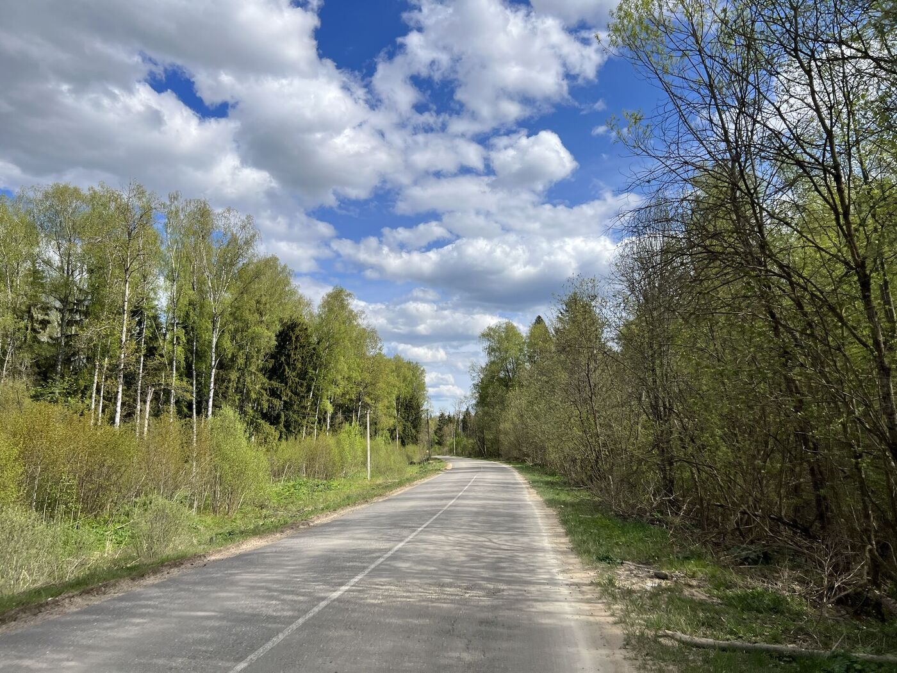

## Старый железнодорожный мост

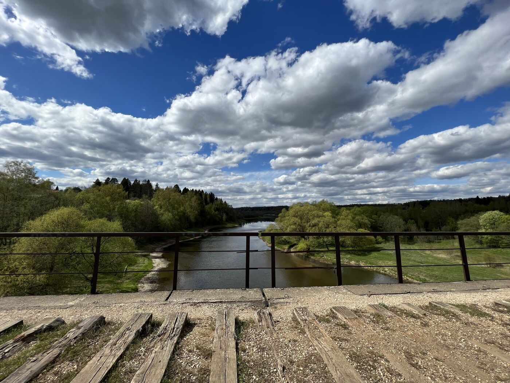

Первым знаковым объектом на маршруте становится старый железнодорожный мост.
Это историческое сооружение сохранилось со времён первых железнодорожных линий в регионе.
Сегодня он служит не только памятником инженерной мысли, но и отличной обзорной точкой для фотографий.
В ясную погоду отсюда открывается захватывающий вид на долину реки, а массивные металлические конструкции придают этому месту особую атмосферу.

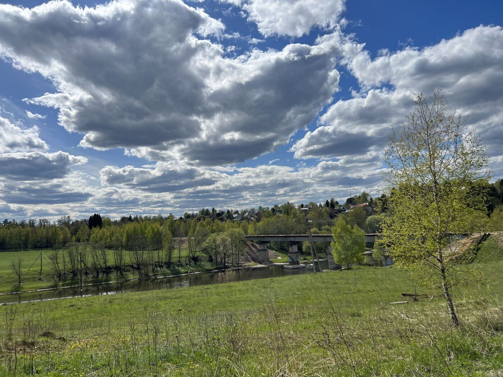

## Марс и подвесной мост

По дороге к следующей точке маршрута можно встретить необычный ландшафт, который местные жители называют «Марсом» из-за характерных красноватых оттенков почвы и необычного рельефа. 
Этот участок местности окружён лесами и полями, создавая идеальные условия для неторопливой велопрогулки.

### Подвесной мост у Тучково

Одним из самых живописных мостов маршрута становится подвесной мост через Москву-реку. 
Его конструкция, слегка раскачивающаяся при переходе, создаёт ощущение лёгкого приключения. 
Здесь можно устроить короткую остановку, чтобы полюбоваться гладью воды и окружающими лесными массивами. 
Вдали видны крутые берега, заросшие вековыми деревьями, создавая ощущение уединённости и спокойствия.

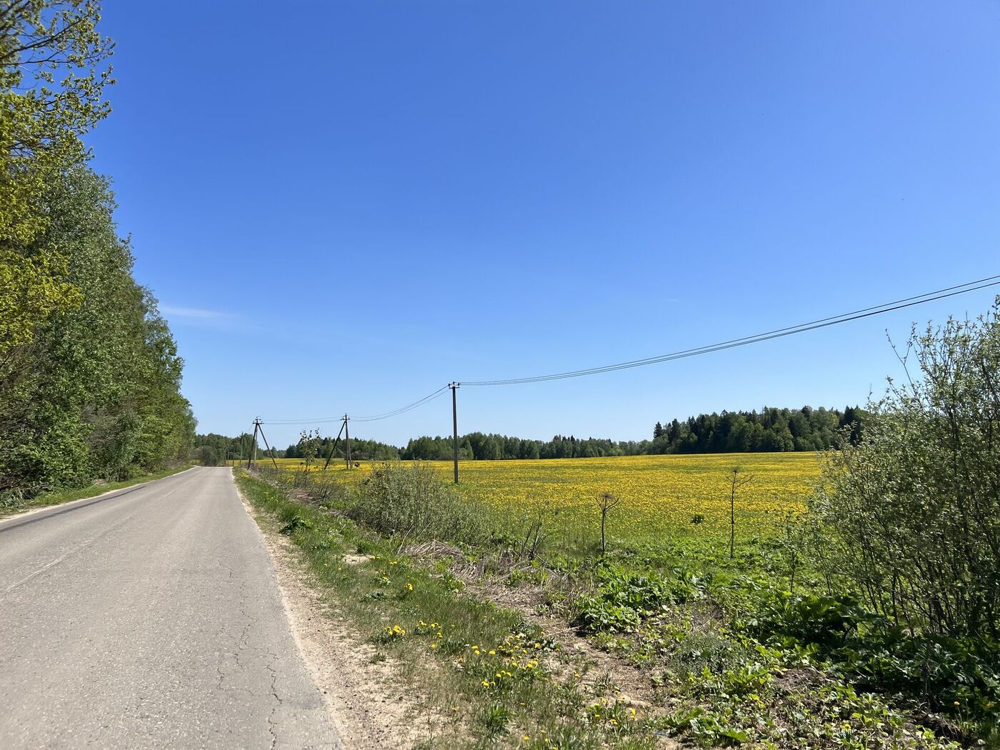

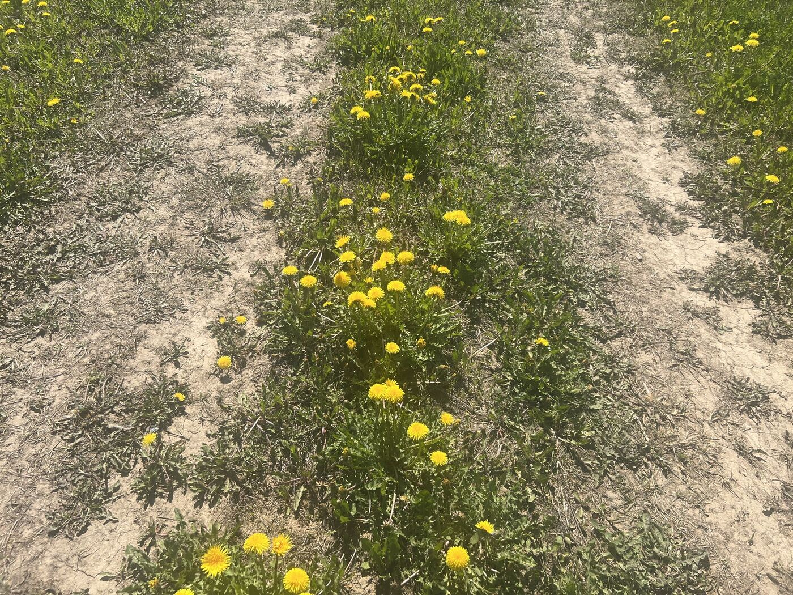

## Полушкинские каменоломни

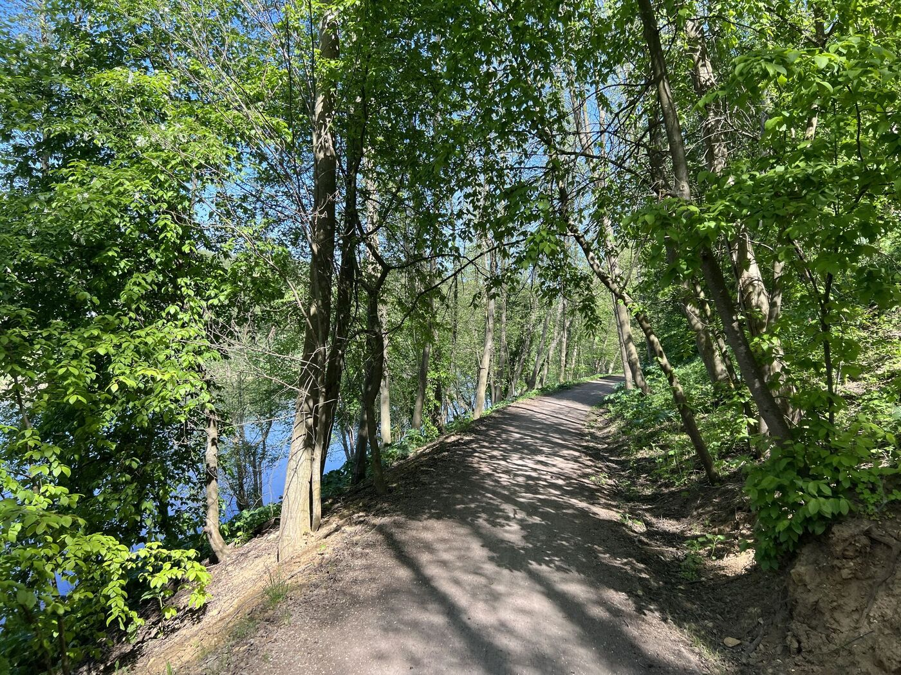

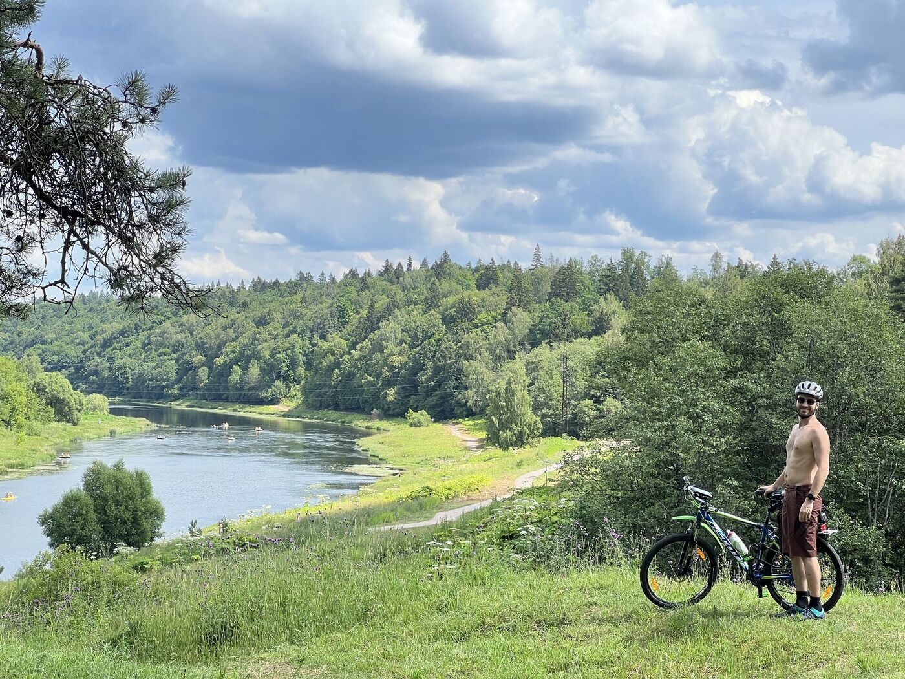

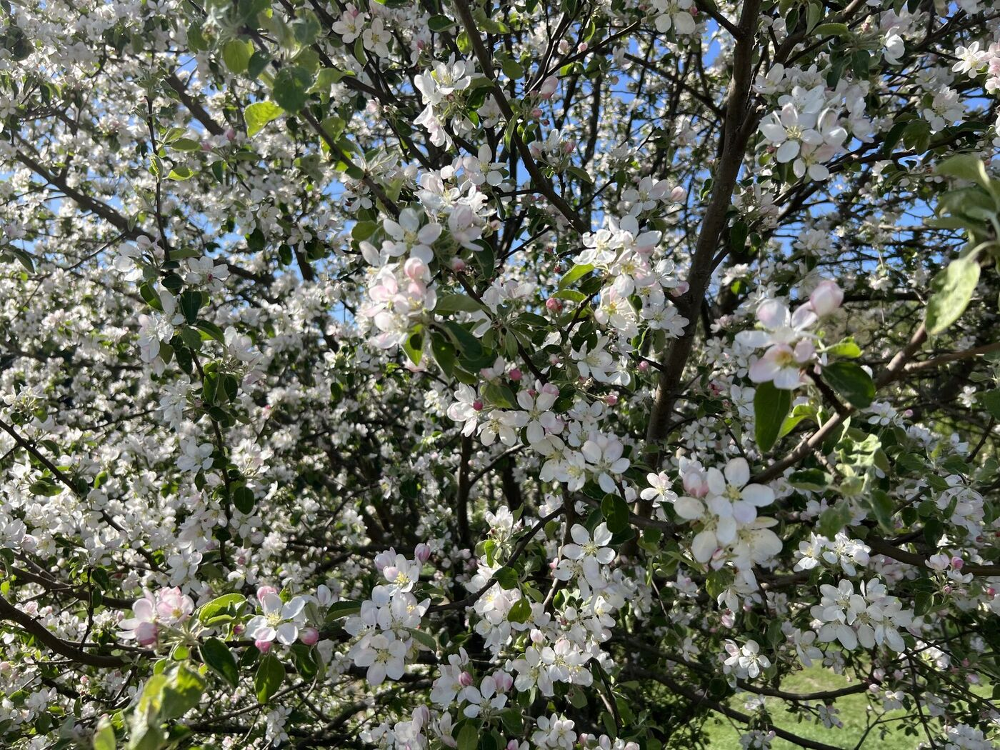

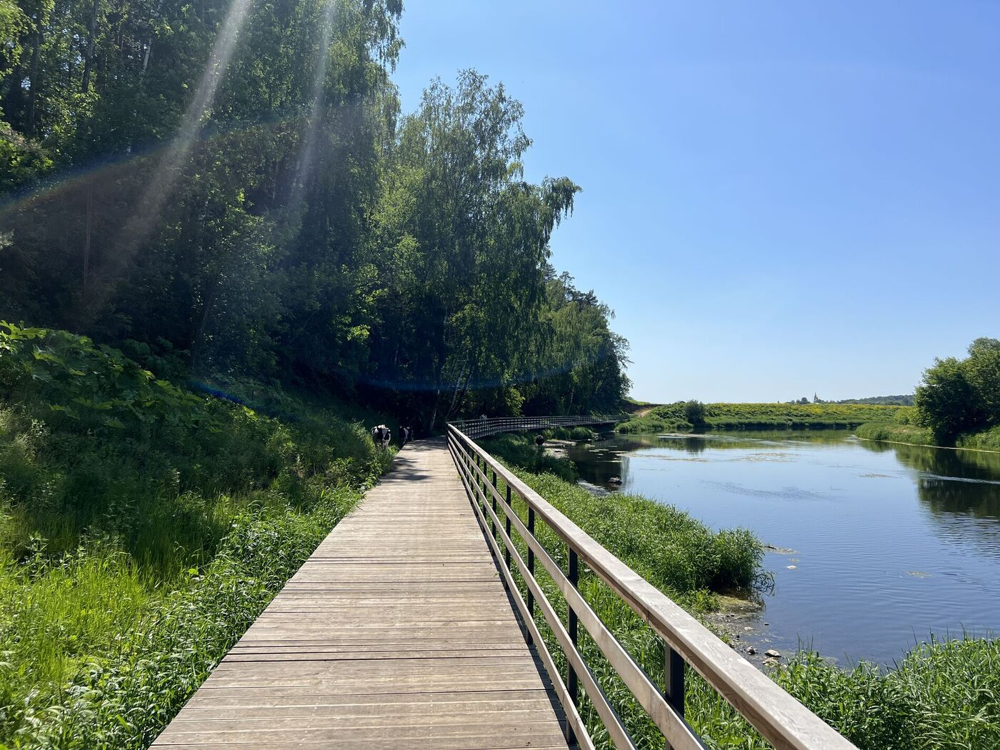

## Васьельевское и санаторий им. Герцина

Деревня Васильевское известна не только своим живописным мостом, но и историческими местами, связанными с именем великого мыслителя Александра Герцена.

Санаторий Герцена

Этот санаторий был основан в середине XX века и использовался для оздоровления и отдыха. 
Расположенный на возвышенности, он предлагает потрясающие виды на реку и окрестности. 
Интересно, что сам Герцен упоминал эти места в своих мемуарах, описывая их как одни из самых живописных в России.

====

Васильевское — это место, где начинался Герцен.

Не в книгах, не в парижских салонах, не в ссылке. А здесь, среди ивовых аллей, песчаных отмелей и липового воздуха, в доме на берегу Москвы-реки, где сквозь трещину в стене росла стройная берёзка.

«Я страстно любил деревенскую жизнь… Леса, поля и воля вольная…»

Каждое лето он возвращался — и каждый раз с новой книгой, с новым взглядом, с новым дыханием. В детстве — сказки, в юности — Шиллер, в отрочестве — первые философские статьи. Васильевское было для него и школой, и убежищем, и колыбелью мысли.

Позже он писал: «Я мало видел мест изящнее Васильевского…» Ни Италия, ни Швейцария не смогли вытеснить из его памяти вид с Марьиной горы, где «всё стлалось до конца, и сквозь всё — голубая тесьма Москвы-реки».

Даже через десятилетия, вернувшись после ссылки, Герцен ощутил, как воздух здесь пахнет юностью.

«Только при этой реке, при этих липовых аллеях — всё вновь оживало…»

Сегодня здесь — тишина. Но если прислушаться, можно уловить отголосок свободной мысли, рождавшейся между полем и книгой, между лесом и голосом — тогда, когда вся жизнь ещё была впереди.

### Мост через Москву-реку

Подвесной мост в Васильевском — ещё одно удивительное сооружение, гармонично вписанное в природный ландшафт. 
Отсюда открываются панорамные виды на окрестные леса и поля, создавая ощущение безграничного простора.

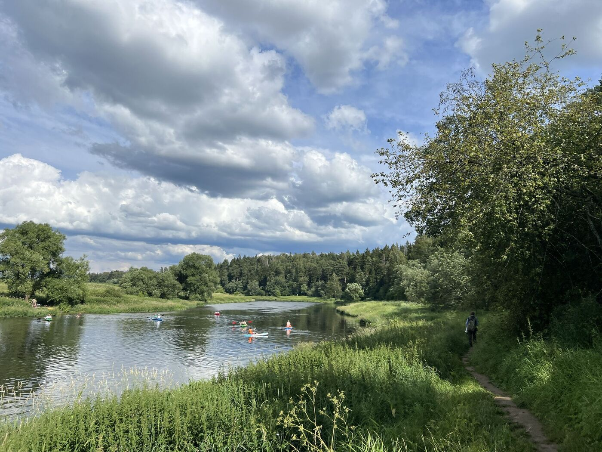

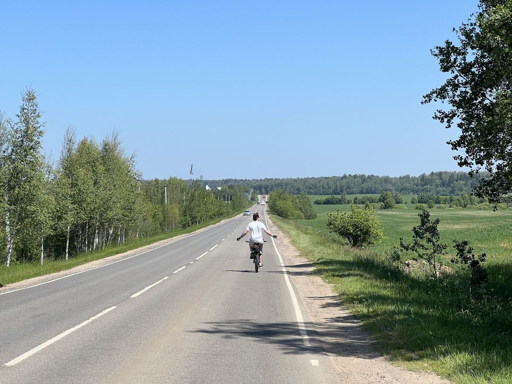

## Болото карьера Сима

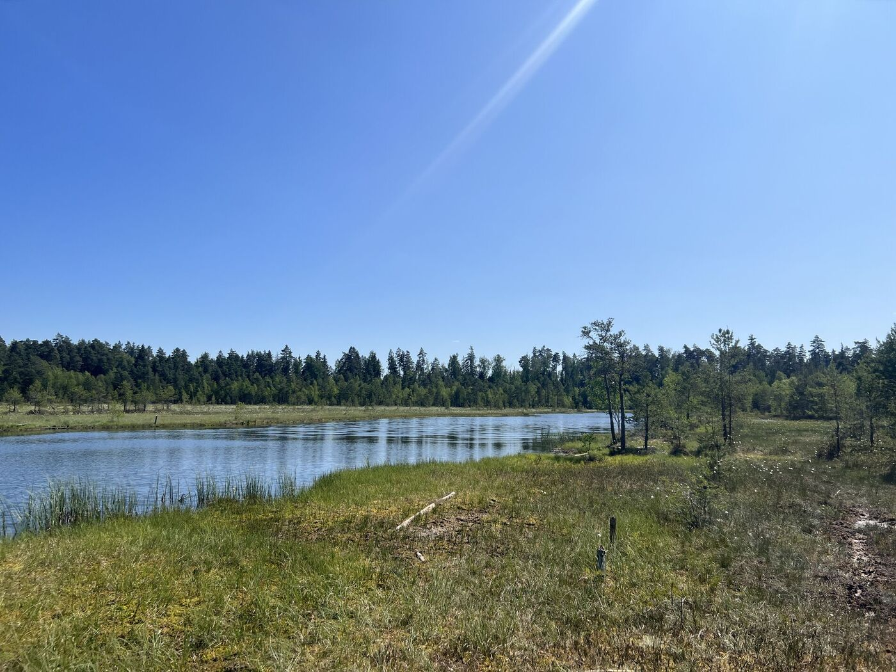

### Продолжение пути через Гигирёво в Каринское

После Волково дорога ведёт через деревню Гигирёво к Каринскому, где находится один из самых длинных подвесных мостов в Московской области.

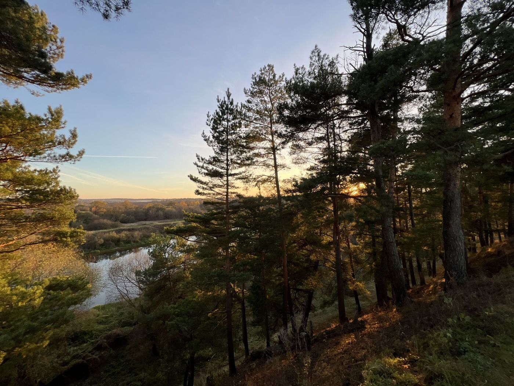

## Биостанции и берег Москвы-реки

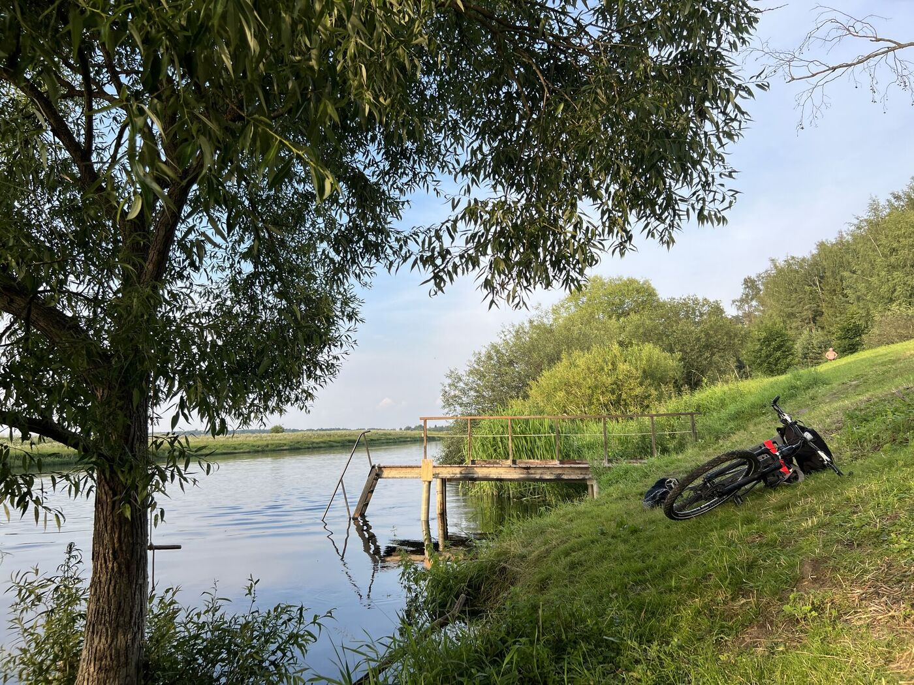

### Саввинский монастырь. Вид издалека

### Городок и Успенский собор. Вид издалека

## До станции Звенигород

<link href="https://api.mapbox.com/mapbox-gl-js/v3.10.0/mapbox-gl.css" rel="stylesheet">

