<link rel="stylesheet" href="../assets-custom/css/style-markdown.css">

	

		

            Полушкино, Сима и Звенигород
        

		

			

                
                
На велосипеде, 46 км.

            

            

                
                1 день
            

		

	

[📍GPX трек poluchkino-zvenigorod.gpx](poluchkino-zvenigorod.gpx)

## От платформы Полушкино

Веломаршрут начинается от платформы Полушкино до которой от Москвы ехать час и 20 минут на электричке с Белорусского вокзала на любой электричке в сторону Дорохово или Можайска, и Бородино тоже.

Время пройдет быстро.

Выйдя с электрички мы сразу же попадаем в атмосферу дачного Подмосковья, малочисленной жд станции, с широкими полями и несколькими автомобилями, встречающими приезжающих местных дачников. Стоянка вблизи станции опустевает еж через пару минут от ммашин разьезжающихся с переезда. И мы остаемся наедене с прекрасной природой среднего Подмосковья в тихой, уютной атмосфере дачной жизни, размеренной и спокойно от городской суеты, а воздух наполнен ароматом полевых трав.

Наш путь теперь в сторону санатория и усадьбы Герцина к берегу реки. Неспешная короткая поездка займет минут 10.

Пока не свернули с большой дороги к извилистым дорожкам на берегу реки очень рекомендую заглянуть в большой супермаркет поселка саантория Герцена. Следующий такой же большой будет через час езды на повороте к болоту карьера Симы. 

## К поселку санатория им. Герцена

По пути проезжая ворота старого санатория мы за ними представляем старую усадьбу, скрутыю от обычных посетителей. Здесь в свое время в Васильевском вырос выдяющийся русксий мыслитель Герцен.

Он приезжал сюда почти каждое лето с детства.

«Я страстно любил деревенскую жизнь… Леса, поля и воля вольная — всё это было мне так ново…»

В Васильевском он впервые ущутил вкус свободы к жизни, любил лежать с книгой на траве.

«Что за вид с горы, на которой он стоит, и из моей комнаты в мезонине! Кругом деревни, церкви, леса и через всё — голубая лента реки…»

Герцен любил просыпаться рано, открывать окно и смотреть вдаль. Любил гулять в окрестном лесу, что начинался сразу за домом, — ложился под дерево, читал Шиллера вслух.

В эмиграции Герцен часто вспоминал здешние места:

«Я мало видел мест изящнее Васильевского… Ни Сорренто, ни Альпы, ни французские сады — ничто не изгладило этих запахов, этой влажной прохлады трав, этой зелени».

«Я только при этой реке, при этих липовых аллеях могу ярко перенестись в те времена, когда вся жизнь лежала впереди, и на душе всё было пёстро и зелено…»

После революции усадьба была преобразована в санаторий, попасть в который было возможно еще до недавнего времени.

А сейчас мы проезжаем мимо усадебных ворот по крутому спуску и оказываемся на берегу в Васильевском.

## Васильевское, подвесной мост и велодорожка вдоль берега Москы-реки

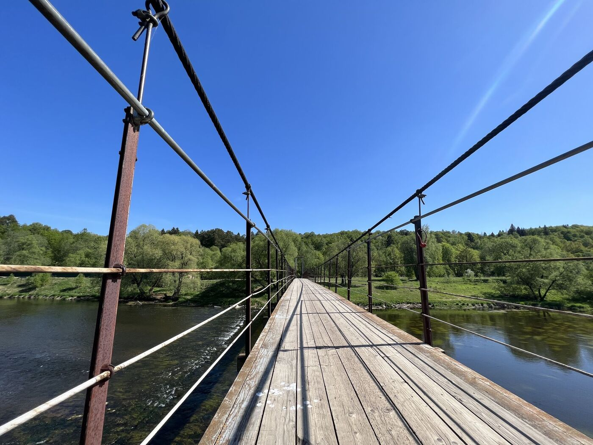

Подвсеной пешеходный мост встречает нас, перекинутый через Москву-реку, а на дургйо стороне старый кирпичный храм, кажется, как будто еще видевший Герцена недавно.

Вступая по мосту, раскачивающемуся от наших шагов и других гуляюющих всем телом ощущаем легкость парения в воздухе и над всей далью древней реки. Внизу журчанье воды по перекатам, и наше отражение в зеркале воды и песчаного дна, по которому водоросли колышаться. Красота, гормония с природой, и радость жизни в моменте здесь и сейчас.

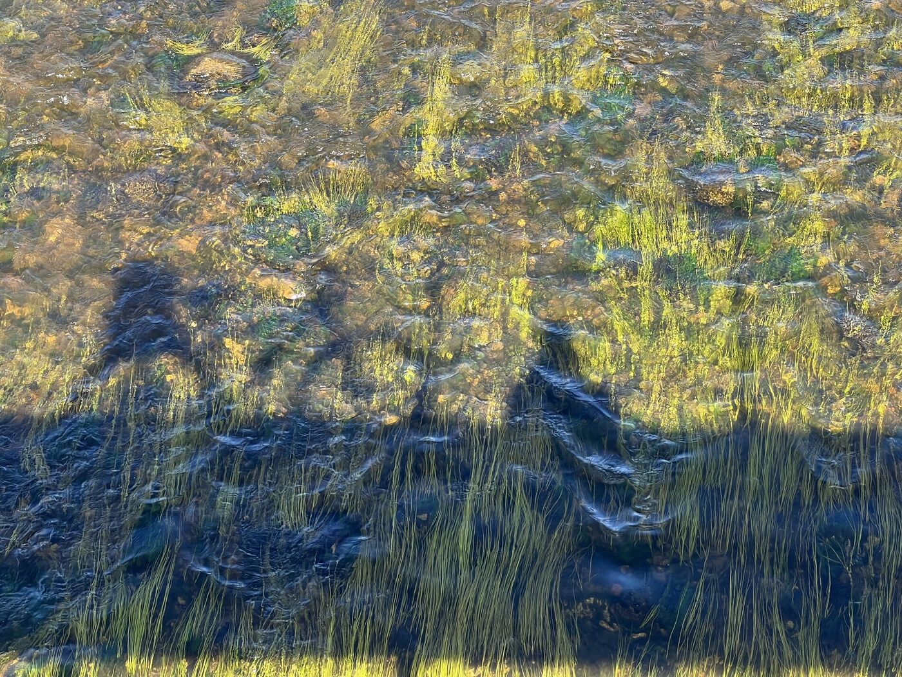

## Едем дальше

Описание короткого пути по берегу, а затем в Агафоново, где можно свернуть на асфальтовую совершенно пустую дорогу, а можно продолжить путь по холмистым дорожкам вдоль берега реки. 

Доезжаем до Волково

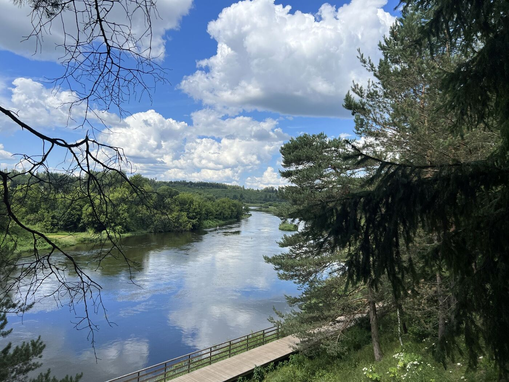

## Бонусный маршрут: в сторону карьера Болота Симы на 3 км туда и обратно

Перед Волково можно свернуть налево к небольшому кольцевому маршруту длиной около 3 км, который ведет в сторону Симова болота и старого карьера. Эта тропа пролегает через густой хвойный лес с мостиками, уютными полянами и удивительной тишиной. Здесь можно остановиться, чтобы перекусить, послушать пение птиц и вдохнуть ароматы хвои.

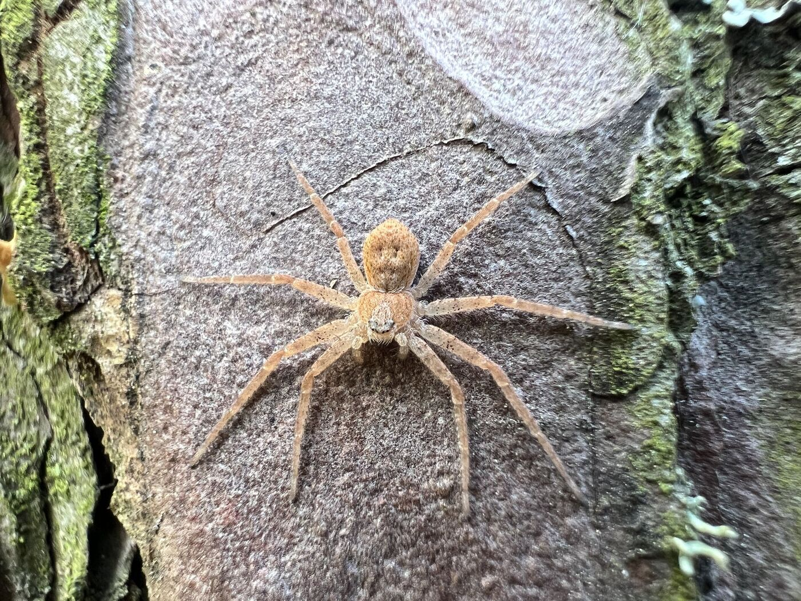

## Уже от Гигирево в Каринское

Основной путь продолжается в сторону деревни Гигирево, затем — к Каринскому. Дорога все время идет вдоль Москвы-реки, открывая живописные виды на противоположный берег и холмы, поросшие лесом. Сам мост в Каринском — один из самых длинных подвесных в Подмосковье, и переход по нему — настоящее приключение.

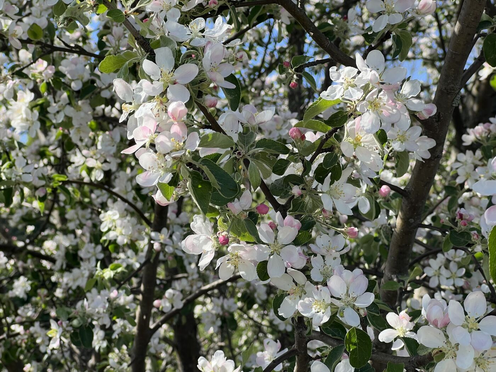

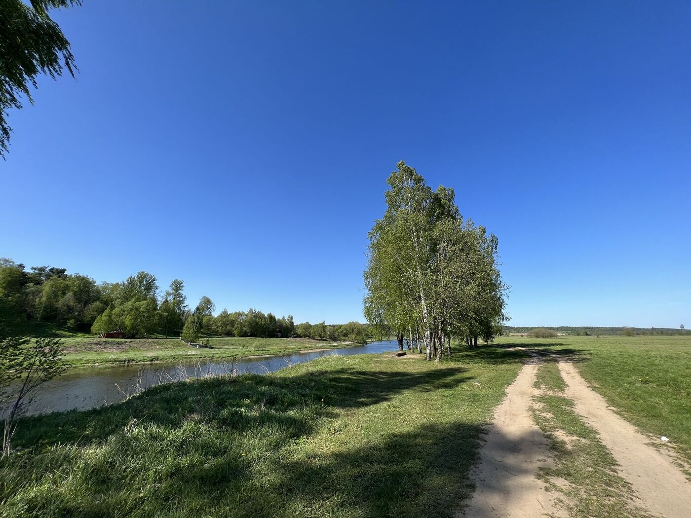

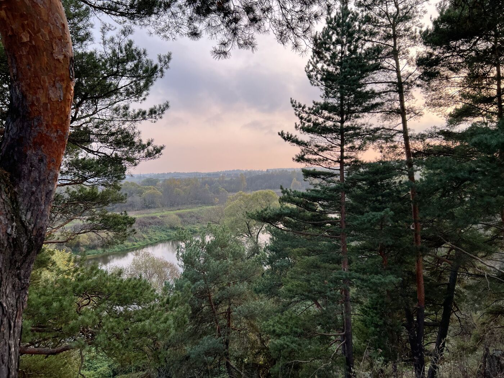

## По берегу у биостанции МГУ

После Каринского дорога идет вдоль реки напротив Лесного массива биостанции МГУ. Здесь проходят учебные практики студентов-биологов, и это место особенно богато на редкие растения, тишину и источники чистой воды. Есть родник с питьевой водой, небольшой пляж и возможность искупаться.

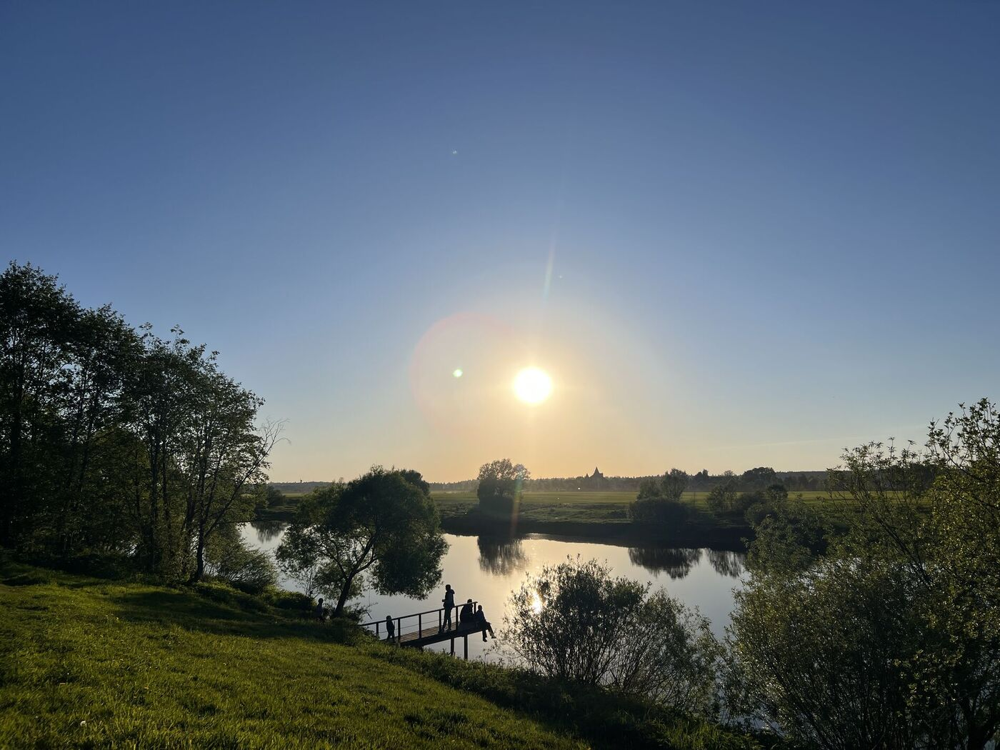

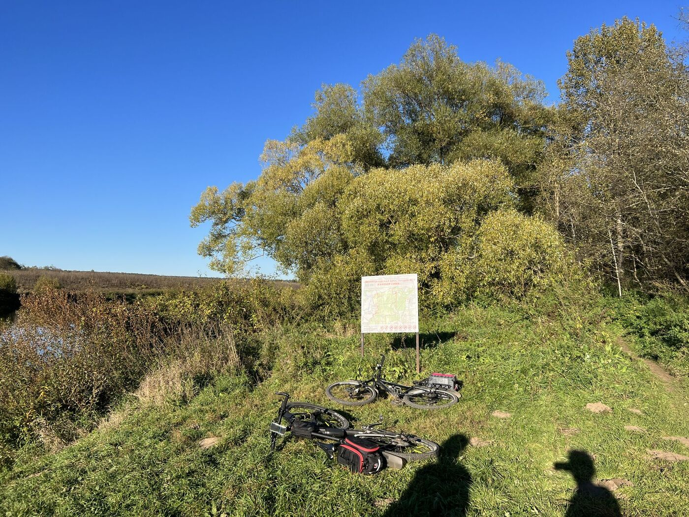

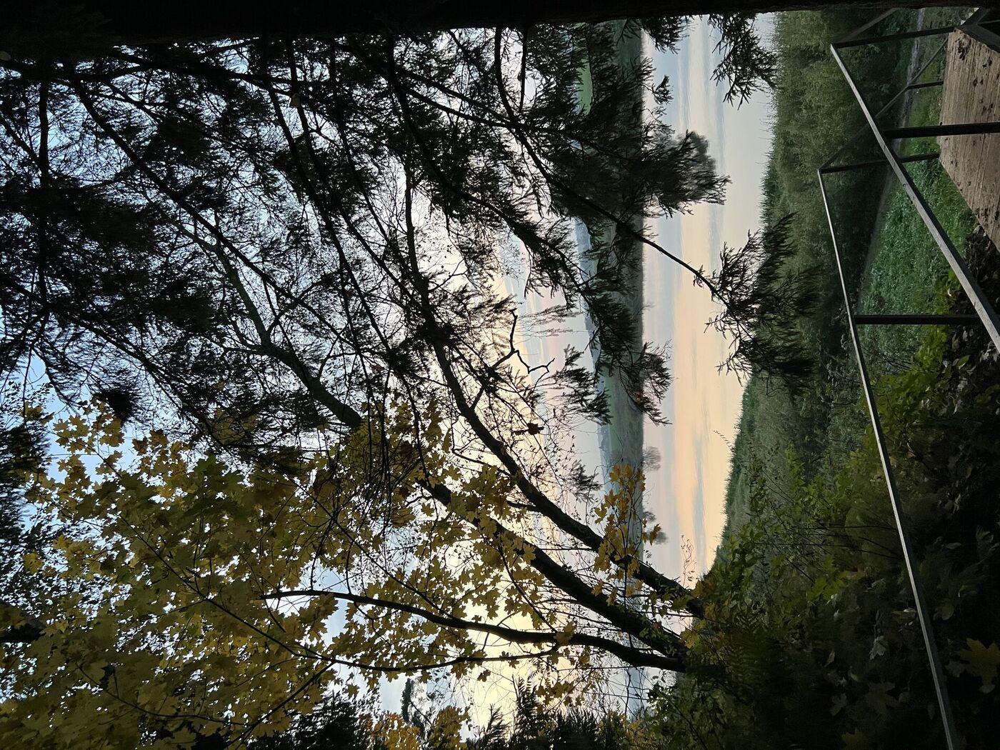

## Звенигород в лучах заходящего солнца и Савинский монастырь на другой стороне.

Дальше — мост БМО, откуда можно наблюдать за железнодорожными составами. Проехав немного вдоль монастырских стен, путь приводит к Звенигороду. Здесь можно остановиться в кофейне "Дом" или "Хлебник", выпить чашку хорошего кофе и купить вкусной выпечки. До станции Звенигород — около 45 минут неспешной езды по проселочной дороге или асфальтированной трассе. Отсюда электричка увезет обратно в Москву (примерно 1.5 часа).

Маршрут идеально подходит для однодневного или уикенд-путешествия на велосипеде: с живописными пейзажами, природными достопримечательностями и уютными остановками.

## К станции и путь обратно в Москву

Путь домой займет час и 20 минут на электричках, которые тут отходят довольно часто.

Неспеша поедая вкусняшки в уходящей электричке приятно обсудить и вспомнить лучшие моменты нашего путешествия.

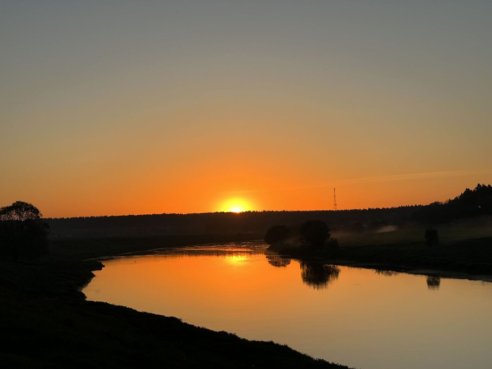

<link href="https://api.mapbox.com/mapbox-gl-js/v3.10.0/mapbox-gl.css" rel="stylesheet">

