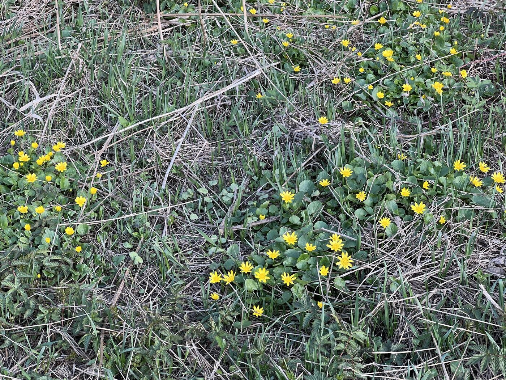
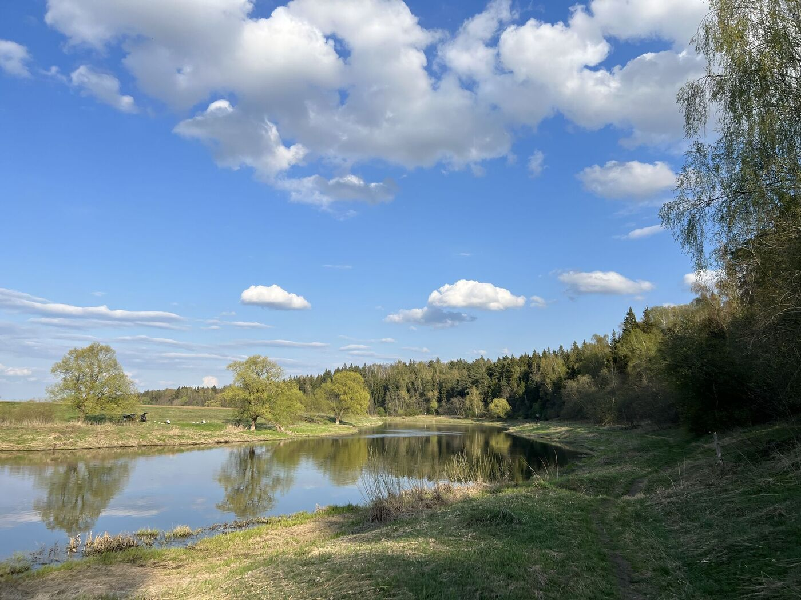

<link rel="stylesheet" href="../assets-custom/css/style-markdown.css">

	

		

            Тучково - Звенигород
        

		

			

                
                
На велосипеде, 64 км.

            

            

                
                1 день
            

		

	

[📍GPX трек tuchkovo-zvenigorod.gpx](tuchkovo-zvenigorod.gpx)

## Тучково и начало веломаршрута по берегу Москвы-реки

## Полушкинские каменоломни

## Васьельевское и санаторий им. Герцина

## Болото карьера Сима

## Мост в Каринском

## Биостанции и берег Москвы-реки

## Звенигород

## Станция Звенигород

<link href="https://api.mapbox.com/mapbox-gl-js/v3.10.0/mapbox-gl.css" rel="stylesheet">

