<link rel="stylesheet" href="../assets-custom/css/style-markdown.css">

	

		

            Тучково - Звенигород
        

		

			

                
                
На велосипеде, 64 км.

            

            

                
                1 день
            

		

	

[📍GPX трек tuchkovo-zvenigorod.gpx](tuchkovo-zvenigorod.gpx)

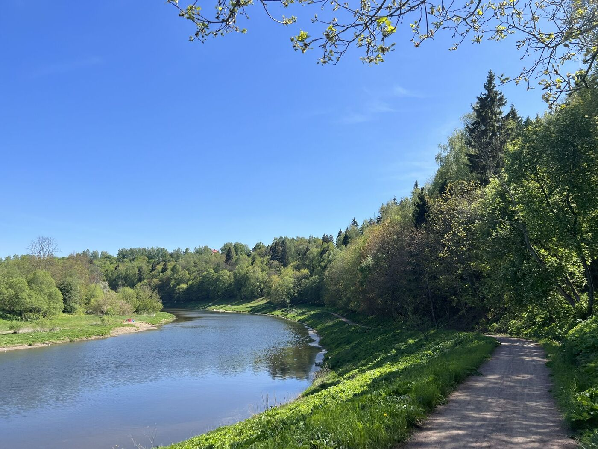

## От станции Тучково. Начало маршрута

Начало веломаршрута от станции Тучково открывает перед велосипедистами увлекательное путешествие по живописным берегам реки Москвы. 

Маршрут протяжённостью около 40 км проходит через живописные леса и поля, соединяя несколько подвесных мостиков, которые придают особый колорит путешествию.  

По пути можно посетить такие исторические и культурные достопримечательности, как усадьба “Любвино”, замок Щербатовых и несколько старинных церквей.  

Недавно была анонсирована разработка веломаршрута, который свяжет Тучково и Звенигород, протяжённостью 21 км.  

## Начало маршрута

< 🌳 Фогорафия станции Тучково >

Маршрут начинается от железнодорожной станции Тучково, куда удобно добираться с Белорусского вокзала. 

Добраться можно с Белорусского вокзала за 1 час и 30 минут на элеткричках до Дорохова и Можайска. Они ходят довльно часто, обычно каждый час, а в выходные дни отправляются чаще.

Рядом со станцией Тучково имеется пекарня со свежей выпечкой, где можно вкусно перекусить на завтрак перед началом путешествия. А также рядом есть несколько супермаркетов: Пятерочка и Дикси, в которых стоит запастись водой и вкусняшками на первую половину пути.

### Вдоль усадьбы Любвино к Москве-реке

Свернув с проезжей дороги мы направимся сразу же в сторону старой усадьбы Любвино.
По главной усадебной аллее свернем в сторону от закрытых ворот усадьбы, к сожалению, сегодня она находится в разрушенном состоянии и нуждается в реставрации. Со стороны тропинки можно увидеть развалины усадебного дома.

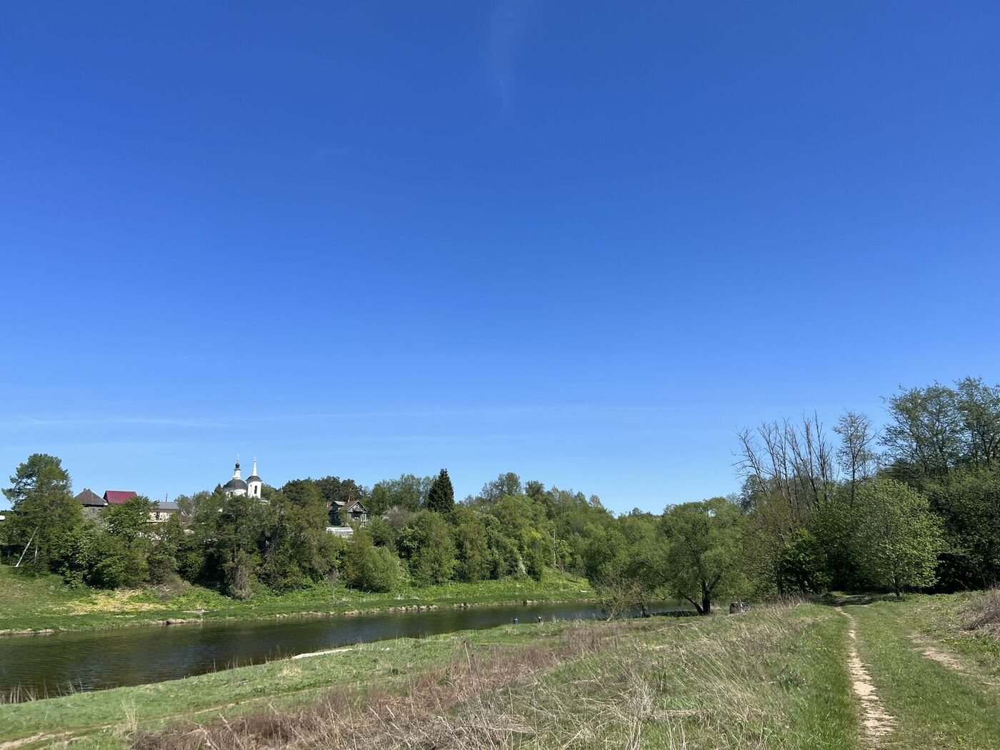

В свое время здесь бывали Федор Шаляпин и Константин Коровин. После революции усадьба была национализирована и использовалась как санаторий для детей с заболеваниями дыхательных органов. Позднее на её территории снимали сцены для фильма «В круге первом» Солженицына.

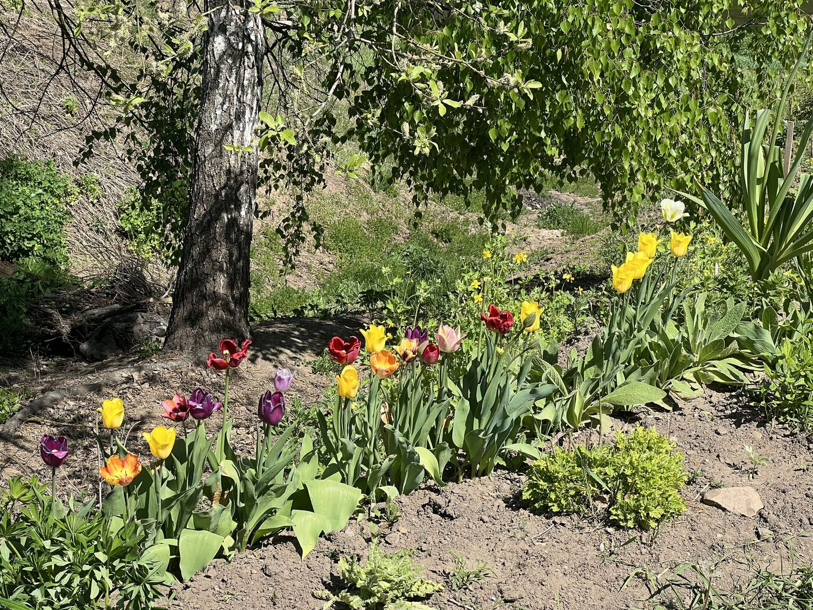

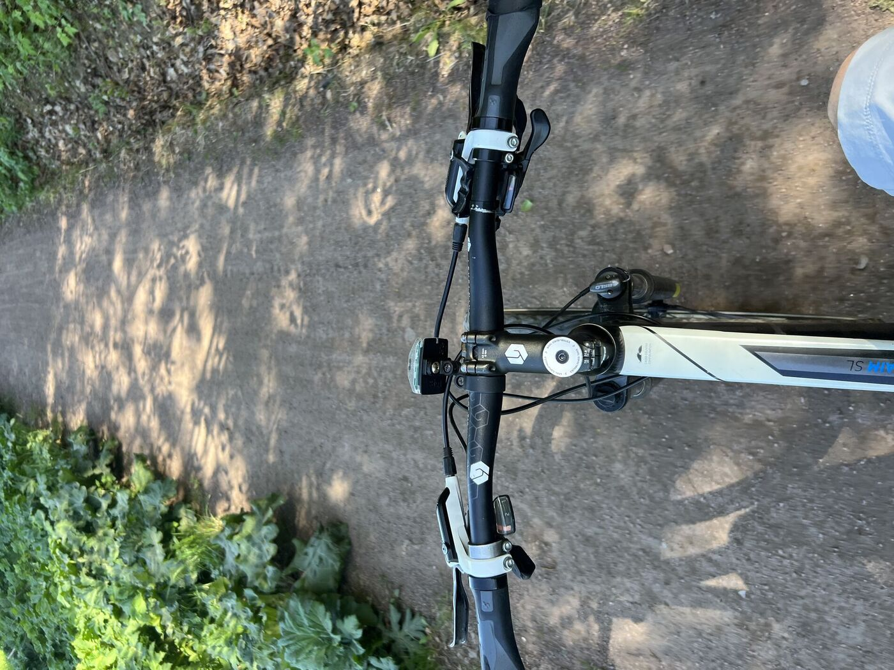

### На берегу Москвы-реки

Прекрасная поляна с пляжем на берегу открывается в конце тропинки. 

Здесь устроена прекрасная территория отдыха. И здесь же мы увидим карту с началом веломаршрута Вело2Руза, который начали организовывать пару лет назад вдоль Москвы-реки. Поедем по нему.

### Вдоль Полушкинских каменоломен

В Полушкино находятся знаменитые каменоломни, откуда в XVI-XVII веках добывали белый камень для строительства зданий Московского Кремля. Сегодня здесь можно услышать из глубины леса щелчки застегивающихся альпинистских карабинов и команды тренера детских команд по туризму. В другие дни здесь проходят соревнования по спортивному туризму. Каменоломни утопают в зелени высоких прибрежных деревьев, придавая таинственности этим местам.

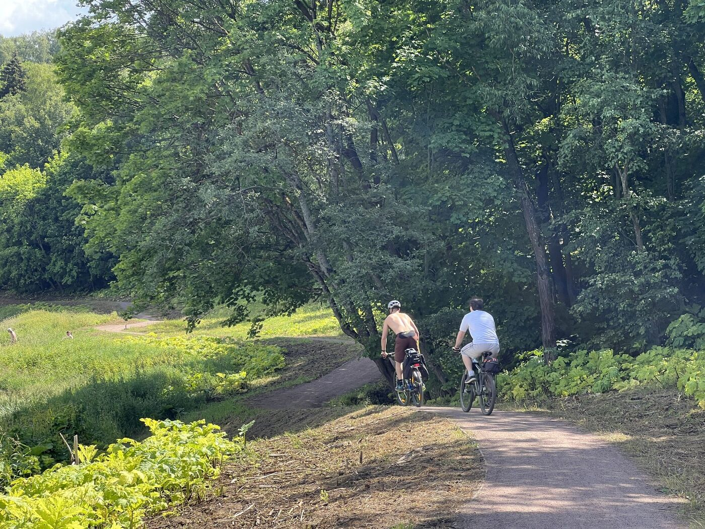

Рекомендуется посетить Каменоломни отдельно, лучше всего туда добраться по другому Васильевскому берегу вблизи реки в хорошую сухую погоду.

Маршрут продолжается через живописные леса и опушки до деревни Васильевское. По пути открываются прекрасные виды на речные изгибы и высокие берега Москва-реки.

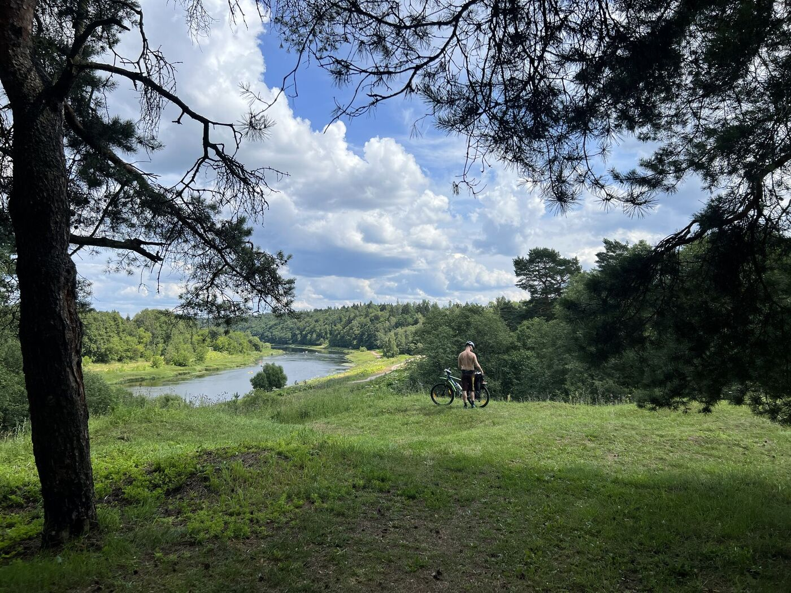

## Санаторий Герцина в Васильевском

В Васильевском на крутом берегу реки располагается семейная усадьба Герцена, которая сегодня стала санаторием.

«С Покровским, с Васильевским, с их лесами, горами, рекою связано моё детство, моё отрочество, время, когда верилось в зарю счастья», — писал он в «Былом и думах».

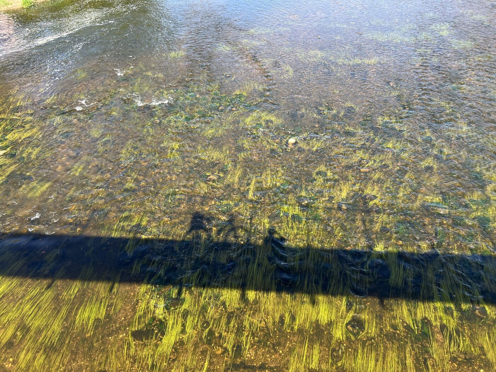

«Я открываю окно и смотрю, и дышу. А потом ухожу в лес и читаю вслух Шиллера, лежа под деревом».

Здесшние пейзажи остались с Герцмным на всю жизнь. Ни Сорренто, ни Альпы, ни Тауэрский мост не вытеснили из его памяти вид Васильевского с высоты: покатый склон, ржаное поле, дорожка в лес, запах смолы, сырой листвы, сена. Он вспоминал это место даже в Лондоне, в разгар политических бурь. И писал: «Я мало видел мест изящнее Васильевского…»

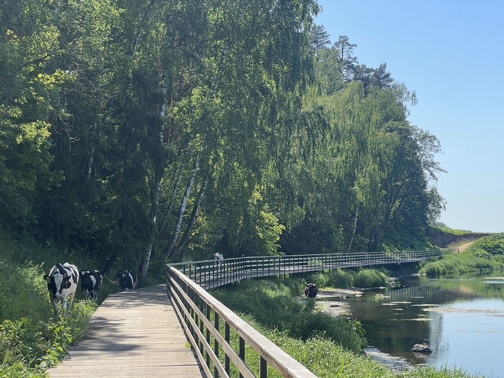

### Подвесной мост в Васильевском

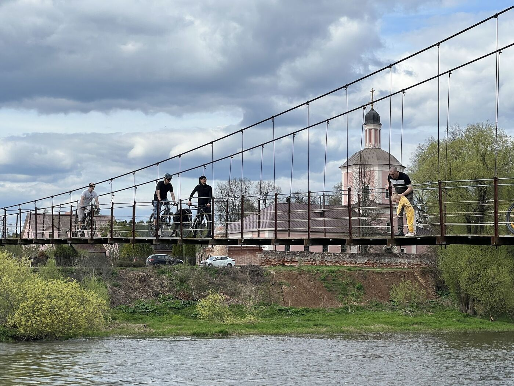

С холма, на котором стоит церковь Николая Чудотворца, открывается впечатляющий панорамный вид на округу. Церковь вместе с остатками усадьбы и старого господского дома входит в единый архитектурный ансамбль, описанный ещё Александром Герценом в своих воспоминаниях.

"Я мало видал мест изящнее Васильевского…"

## Путь дальше 

Можно продолжить путь по буругу, там много кочек, длиннее, но живописнее, чем по шоссе, но на нем также можно увидеть красивые долины Москвы-реки.

Мы почти доезжаем до Волково или Рязани.

Здесь можно заглянуть в Пятерочку, а на повороте сделать круговой маршрут до болота карьера Симы.

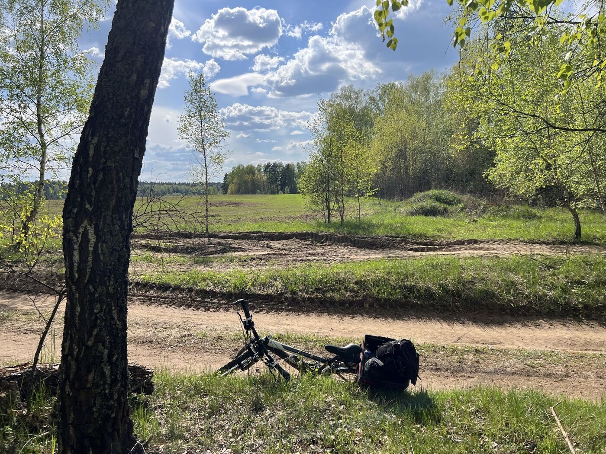

# В сторону болота Карьера Симы

Это отдельный круговой путь в 3 км по живописному заповедному лесу.

Запланируйте дополнительный час времени заехать на Симу.

Этот участок — дополнительная петля маршрута. Из деревни Волково можно сделать петлю длиной около 3 км туда и обратно по хвойному лесу к старому карьеру Сима, на дне которого образовалось настоящее болото с живой природой.

По пути увидите настоящие лесные тропы, деревянные мостики к болоту, послушаете тишину, уединение и пение птиц, возможность понаблюдать за природой в её первозданной форме

Маршрут туда и обратно по старому лесу станет отдельным незабываемым приключением, после которого мы вернемся на основную трассу.

## Подвесной мост в Каринском

Велодорога и леса

Из Волково маршрут уходит в сторону Гигирёво и затем приводит в Каринское. Здесь дорога идёт по асфальтовой дороге, с тенистым лесным участкам и широким видам долины реки.

Главная достопримечательность — подвесной мост через Москву-реку длиной 94 метра, один из самых длинных в Подмосковье. Он часто снимался в кино, и очень популярен среди путешественников.

## По берегу вдоль Биостанции МГУ

После Каринского маршрут продолжается вдоль берега Москва-реки по красивой просёлочной дороге. На противоположном берегу — лесной массив биостанции МГУ, и поселок, где проходят учебные практики студентов биофака.

На берегу Биостанции мы можем встерить родник с чистой и вкусной водой, 
место для купания, заросшие берега и великолепные виды на изгибы реки. 

### От Луцыно по полям к жд мосту БМО, где встретить красивый закат

Немного далее по маршруту находится мост Большого Московского Окружного кольца (БМО). Здесь можно наблюдать, как проходят длинные грузовые составы — зрелище внушительное и кинематографичное.

После моста дорога идёт вдоль Москвы-реки. Напротив открывается вид на Саввино-Сторожевский монастырь и верхнюю часть Звенигорода. По просёлочной или асфальтовой дороге (на выбор) можно добраться до города, где стоит сделать остановку.

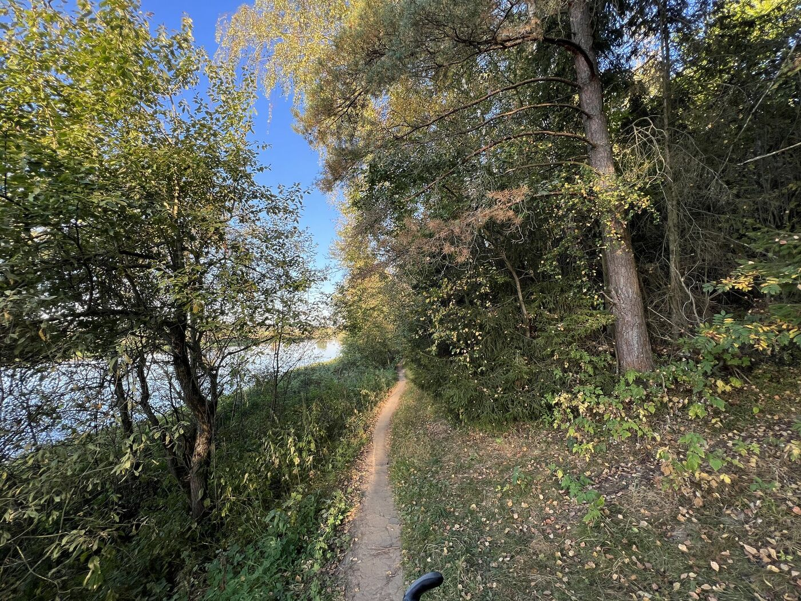

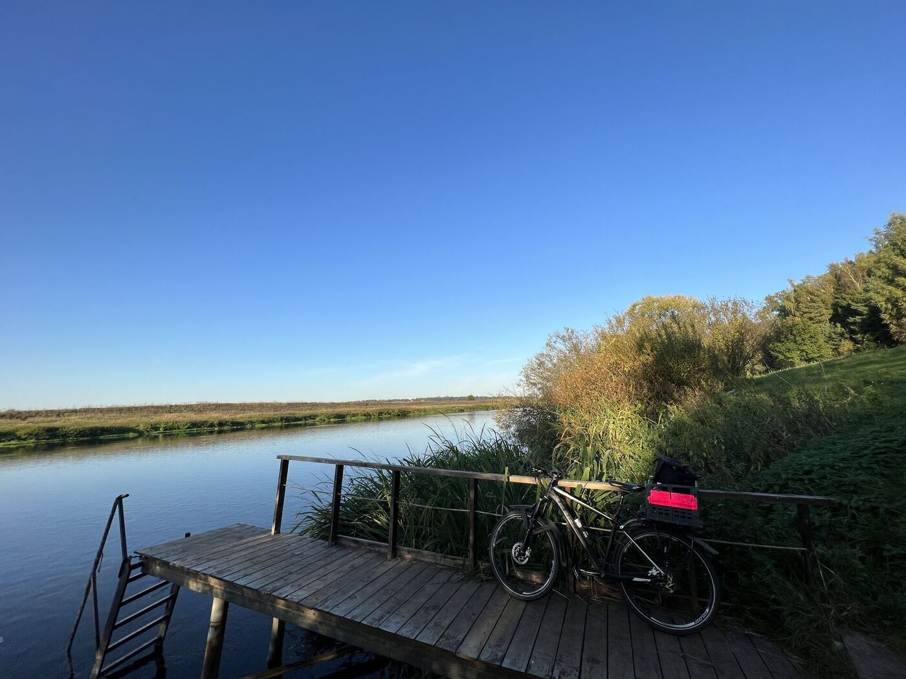

# К станции Звенигород или заехать в город по пути

Проезжая среди вечерней прохлады среди полей по берегу мы можем на другйо стороне реки наслаждаться макушками соборов и белоснежными стенами древнего Саввиноского монастыря в сказочном свете вечерней зори.

**Саввинский монастырь. Вид издалека**

Ближе к городу не забывайте пропустить среди деревьев на другом обрывистом холму прекрасный вид Успенского собора на Городке, вид на которй недавно открылся после многолетней реставрации.

**Городок и Успенский собор. Вид издалека**

У автомобильного моста можно свернуть заехать в город в замечательные кофейни - "Дом" или "Хлебник", насладиться сытным ужином и завершением путешествия.

Посмотреть все достопримечательности в городе Звенигород я рекомендую отдельной поездкой, от которой можно получить отдельное невероятное удовольствие.

# На электричке обратно в Москву

От города к станции дорога занимает какое-то время.
Из центра города - это минут 20-30 по шоссе и 40-50 по лесным дорожкам вдоль берега.

Электрички отходят оыбчно каждые полтора часа
Традиционно вечером это обычно 17:50, 19:30, 20:40, 22:10 и 23:00 
Лучше проверить расписание заранее на сегодняшний день. 
Время до Белорусского вокзала займет 1 час и 20 минут в электричке, отдыхая и обсуждая прекрасное путешествие.

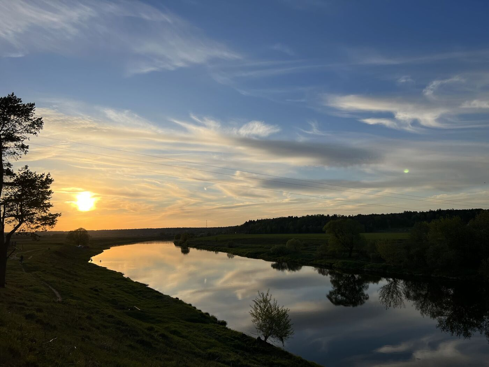

<link href="https://api.mapbox.com/mapbox-gl-js/v3.10.0/mapbox-gl.css" rel="stylesheet">

