<link rel="stylesheet" href="../assets-custom/css/style-markdown.css">

	

		

            Звенигород - Васильевское &#x21BA;
        

		

			

                
                
На велосипеде, 78 км.

            

            

                
                1 день
            

		

	

[📍GPX трек zvenigorod-vasielvskoe.gpx](zvenigorod-vasielvskoe.gpx)

## Звенигород

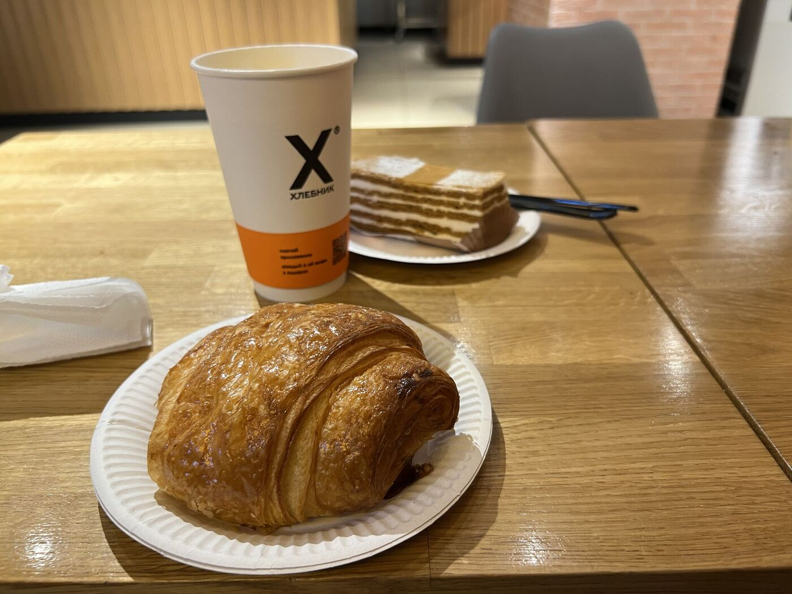

## Каринское

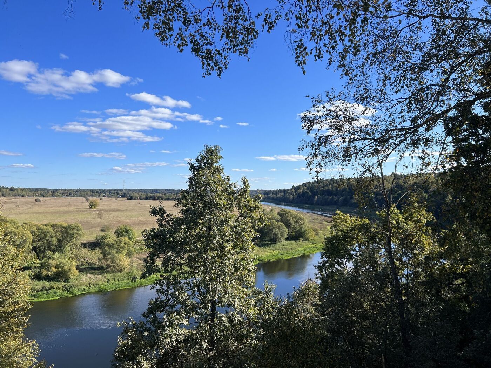

## Васьельевское и санаторий им. Герцина

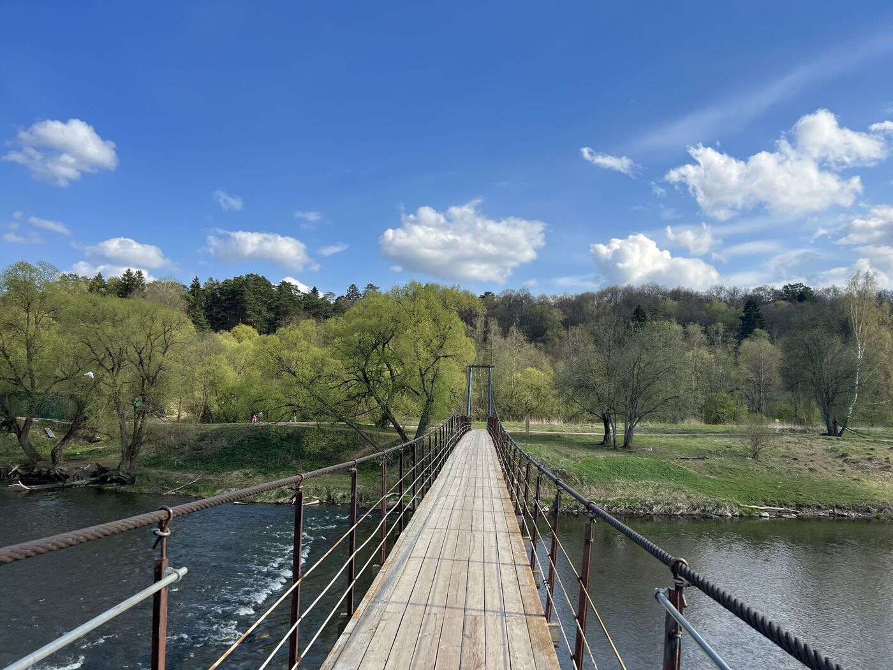

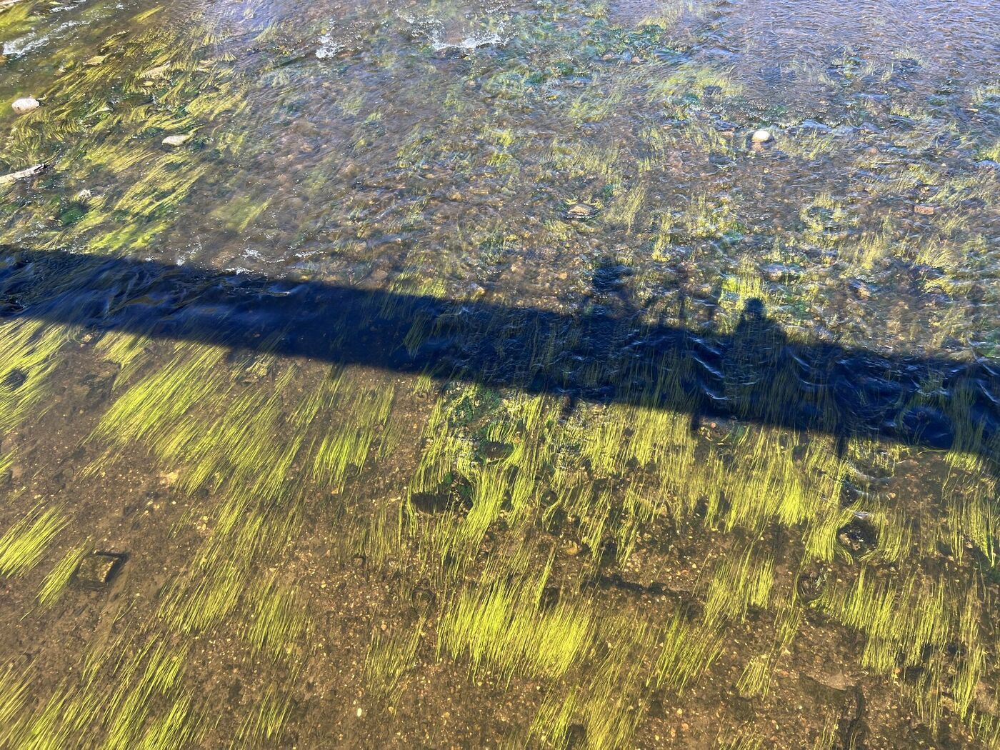

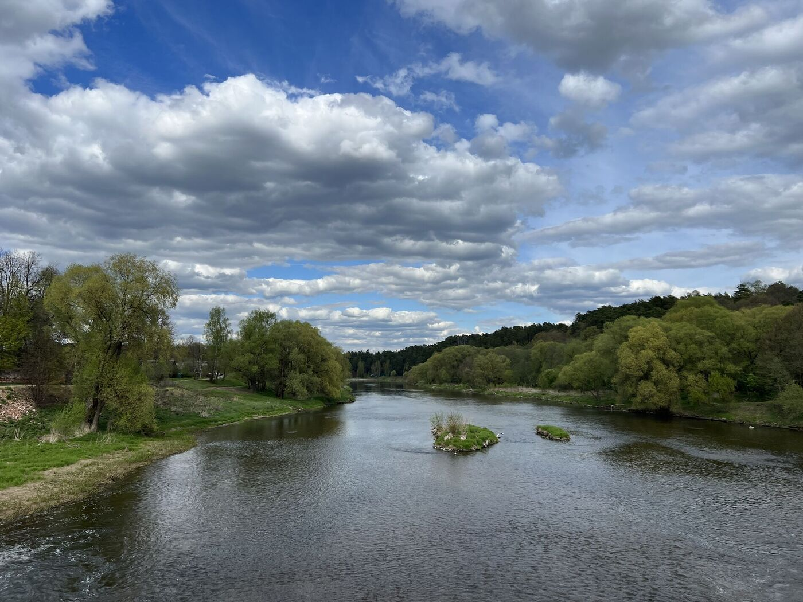

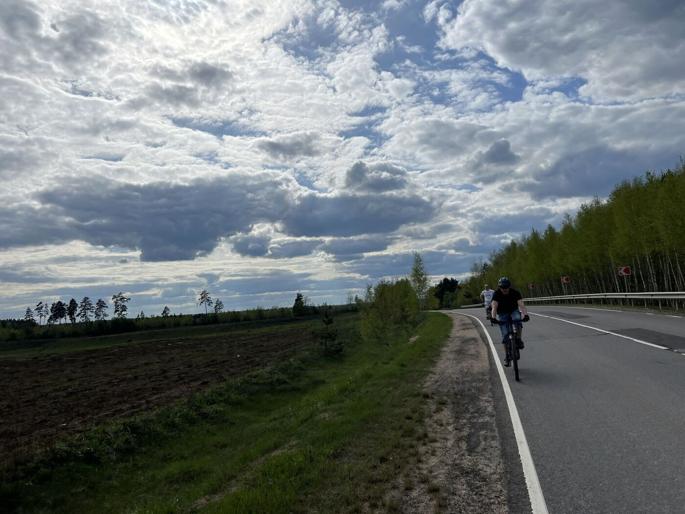

## Биостанции и берег Москвы-реки

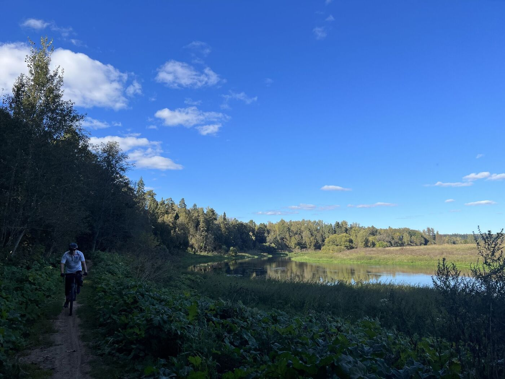

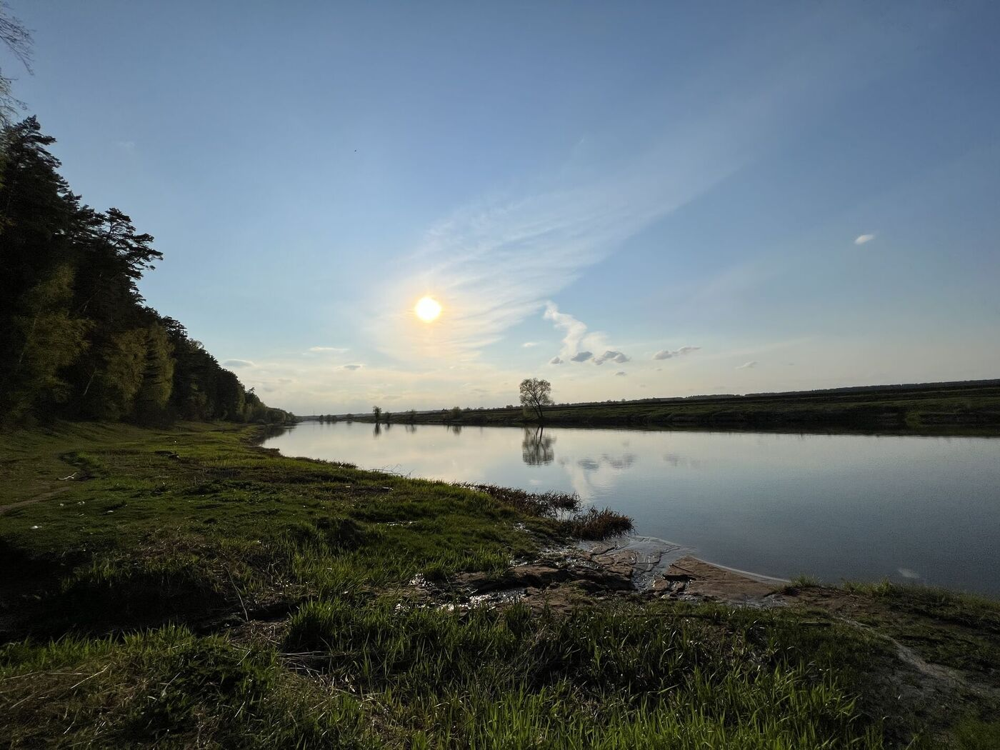

## К станции Звенигород

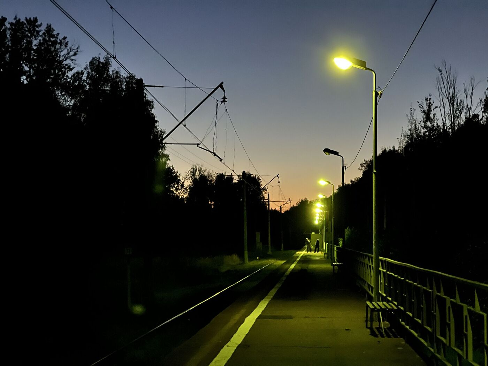

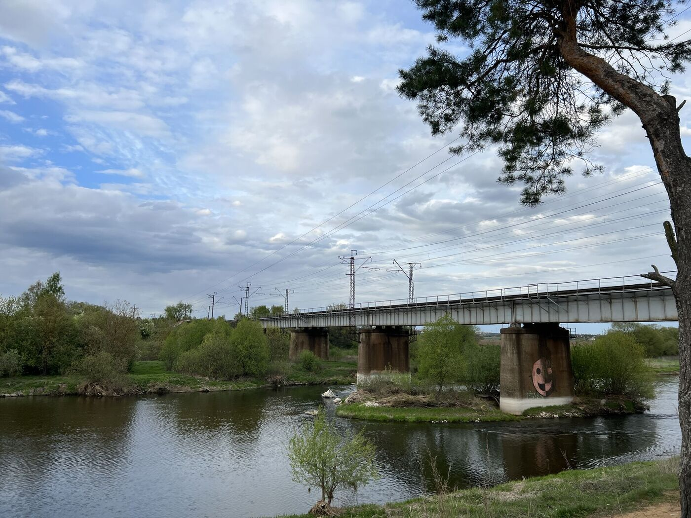

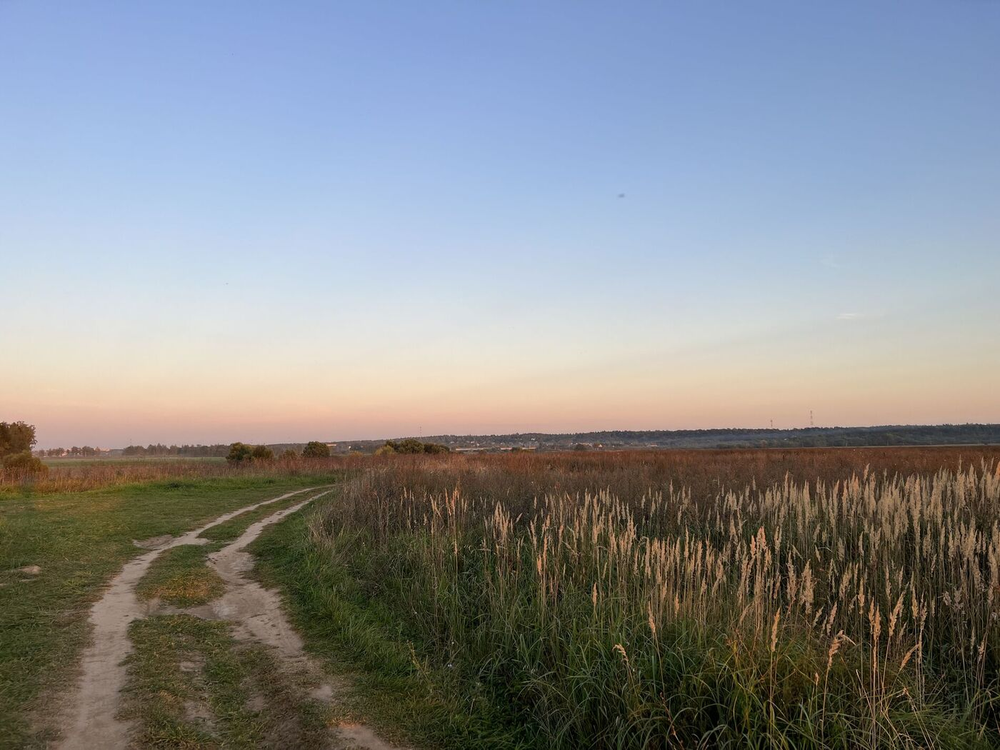

<link href="https://api.mapbox.com/mapbox-gl-js/v3.10.0/mapbox-gl.css" rel="stylesheet">

