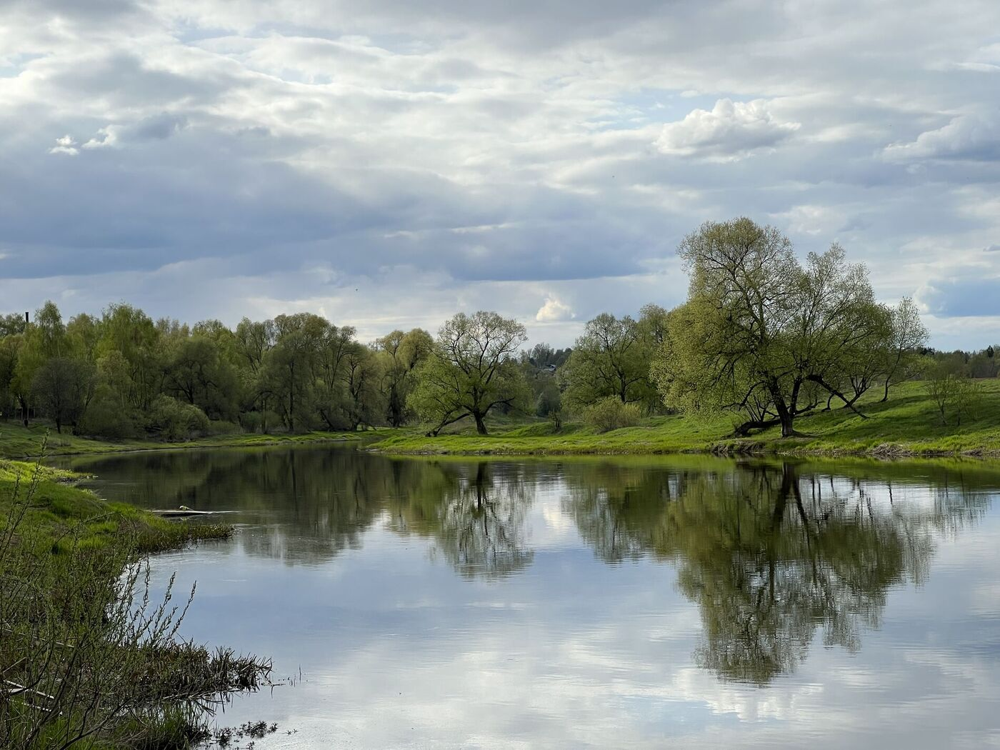
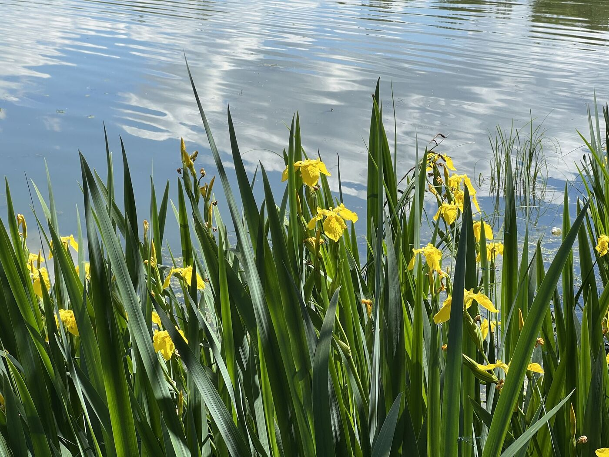
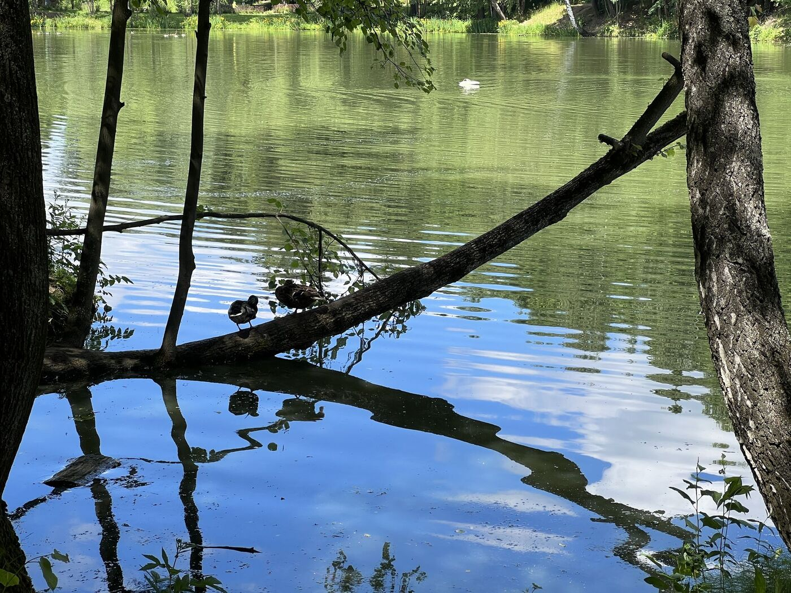
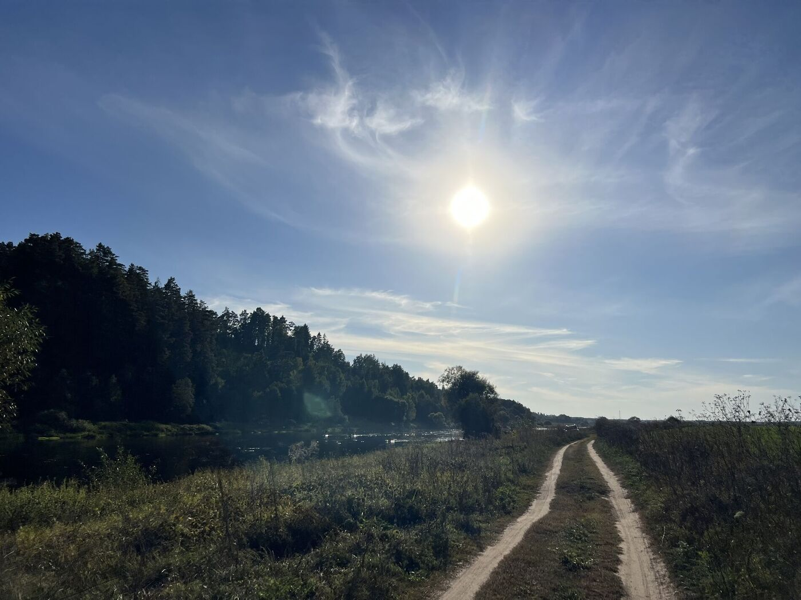
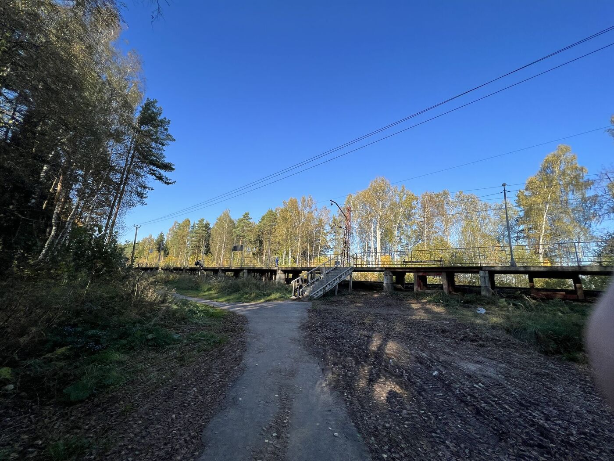
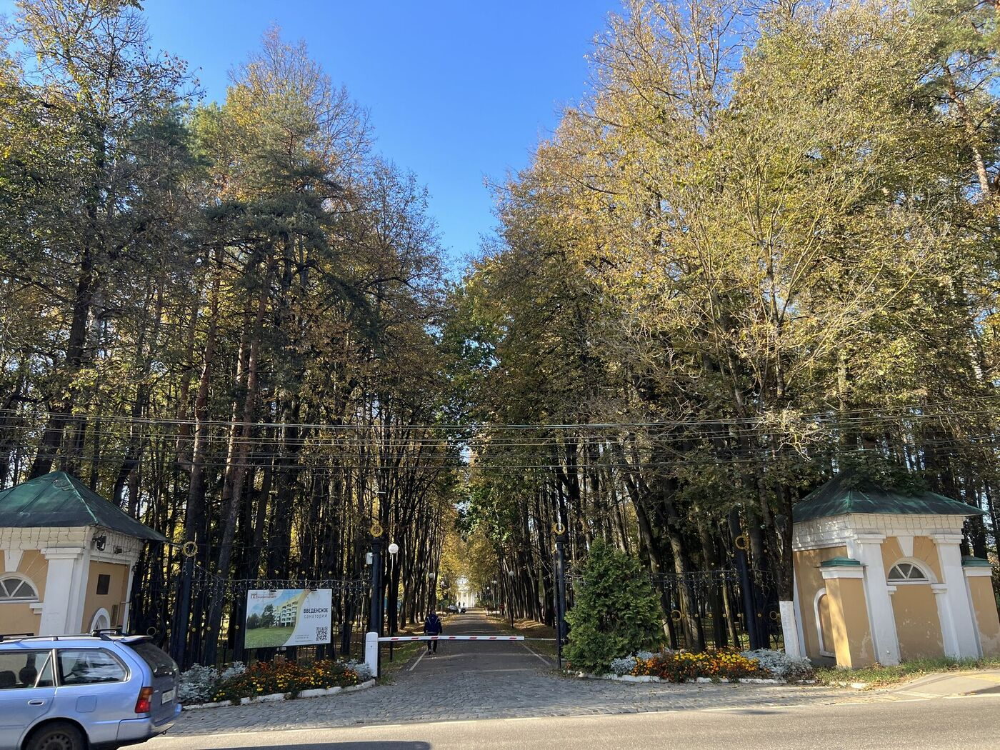
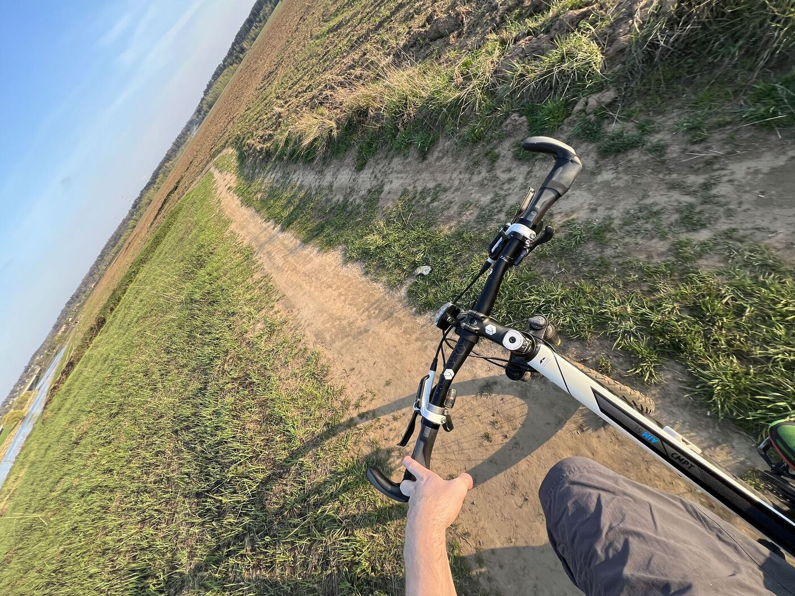

<link rel="stylesheet" href="../assets-custom/css/style-markdown.css">

	

		

            Вяземы, Захарово, Звенигород, Каринское
        

		

			

                
                
На велосипеде, 57 км.

            

            

                
                1 день
            

		

	

[📍GPX трек vyazemy-zaharovo-zvenigorod-karinskoe.gpx](vyazemy-zaharovo-zvenigorod-karinskoe.gpx)

## Станция Голицыно

## Усадьба Вяземы

## Усадьба Захарово 

## Звенигород

## Городок

## Саввино-Сторожевский Монастырь

## Мост в Каринском

## Биостанции и берег Москвы-реки

## Звенигород

## Станция Звенигород

## Биостанция и родник

img-0621.jpg

<link href="https://api.mapbox.com/mapbox-gl-js/v3.10.0/mapbox-gl.css" rel="stylesheet">

