<link rel="stylesheet" href="../assets-custom/css/style-markdown.css">

	

		

            Вяземы, Захарово, Звенигород, Каринское
        

		

			

                
                
На велосипеде, 39 км

            

            

                
                1 день
            

		

	

[📍GPX трек vyazemy-zaharovo-zvenigorod-sloboda.gpx](vyazemy-zaharovo-zvenigorod-sloboda.gpx)

## От станции Голицыно

## Усадьба Вяземы

Большие Вяземы — не просто точка на карте Подмосковья, а место, пропитанное дыханием ушедших веков. Здесь, всего в нескольких километрах от Москвы, среди лесов и прудов возвышается один из редких уголков, сохранивших облик XVI столетия.

Вотчина Бориса Годунова, Вяземы были обустроены с невиданным по тем временам размахом. Пятиглавый каменный храм Преображения Господня, выстроенный в 1598 году, и уникальная звонница, единственная в Подмосковье, дошедшая до нас в своём первозданном виде, производят сильное впечатление. Храм возвышается на прочном подклете, строг и монументален, лишён декоративной пышности, но в его архитектуре чувствуется царственная поступь и рука богатого заказчика.

Здесь бывали польские королевичи, литовские воеводы, купцы, послы и, конечно, великие русские люди. Вяземы были последней остановкой перед Москвой по Большой Смоленской дороге. Здесь встречали иноземные делегации, устраивали «потешные бои», принимали Мари́ну Мни́шек и самого Лжедмитрия. В 1812 году на ночлег в голицынском дворце останавливались и Кутузов, и Наполеон.

Сегодня — всё иначе, но не менее удивительно. Вход на территорию храма и звонницы свободный, и каждый желающий может пройти под древними сводами, услышать тишину, которую некогда перебивали только удары в била. Парк и регулярные аллеи уцелевшей усадьбы доступны за входную плату — всего 50 рублей. Во дворце действует временная экспозиция, рассказывающая о жизни, быте и истории этих мест.

Прогуливаясь по липовым аллеям, легко представить, как тут неспешно шагал Пушкин — в храме Преображения он был крещён. Кажется, его строки ещё витает в воздухе: «И вечно буду я влюблён в усадьбу, в вяземский покой».

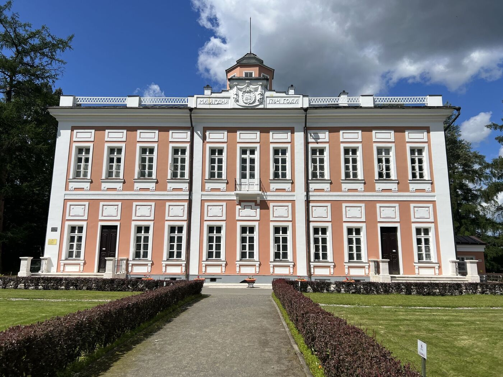

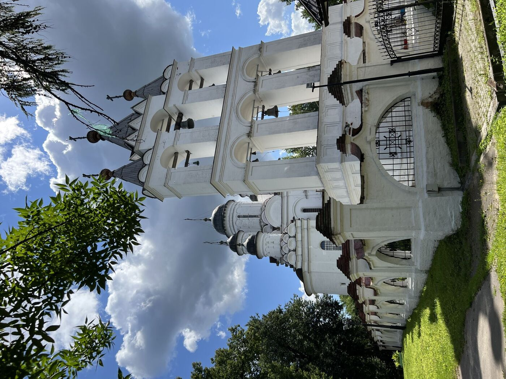

## Усадьба Захарово

Захарово — это больше, чем музей, больше, чем усадьба. Это — уголок, где детство великого поэта растворилось в траве, листве и строчках будущих бессмертных стихов.

Скромное имение близ платформы Школьная стало летним домом Александра Сергеевича Пушкина на протяжении шести лет — с 1805 по 1811. Здесь он впервые узнал радость свободы, поэзию природы и очарование деревенской жизни. Здесь же начал сочинять свои первые стихи.

Мария Алексеевна Ганнибал, бабушка поэта, купила эту подмосковную деревушку с прудом, дубами и «рощею тенистой» за 28 тысяч рублей. В доме, полном простоты, говорили по-русски, пели народные песни и рассказывали старинные сказки. Именно здесь Саша впервые услышал ту речь, тот ритм, что потом зазвучал в его поэзии.

> «Я был рожден для жизни мирной,  
Для деревенской тишины…». 

Он вспоминал Захарово как место тишины и счастья — рощи, где мечтал быть похороненным, липу у пруда, поляну, где устраивали чаепития, и дорожки, по которым он бегал с палкой, воображая себя героем былин.

> «Вот здесь, под дубом наклоненным,  
С Горацием и Лафонтеном.  
В приятных погружен мечтах…»

Дом поэта не сохранился — но воссоздан с любовью. Внутри — интерьеры пушкинской эпохи: простые, светлые комнаты, старинная мебель, скамья у окна. Во дворе — тень тех самых деревьев, свидетелей детства. Многие липы и берёзы были посажены ещё при бабушке поэта.

На выставках можно узнать больше о семье Пушкиных, о гувернёре, о няне Арине Родионовне, о друзьях и соседях. Здесь рассказывают, как деревенская жизнь вдохновила строки не только «Евгения Онегина», но и «Руслана и Людмилы», и «Истории села Горюхина».

> «Мне видится мое селенье,  
Мое Захарово; оно  
С мостом и рощею тенистой.  
Зерцалом вод отражено…». 

До Захарова легко добраться: электричкой с Белорусского вокзала до Школьной, затем пешком — 10 минут. Вход в парк свободный, экскурсии и экспозиции в музее доступны по доступной цене. Особая атмосфера летом — когда липы в цвету, а над водой стелется утренний туман.

Отсюда рукой подать до Больших Вязем, куда маленький Пушкин ходил в церковь, слушал рассказы о Годунове, о Лжедмитрии и, возможно, впервые прикоснулся к тем сюжетам, что позднее воплотились в его трагедии «Борис Годунов».

Захарово — это не просто пушкинское место. Это начало большого русского пути. Это родина лирики и светлого воспоминания. И пока шумят деревья у пруда, Пушкин здесь — рядом.

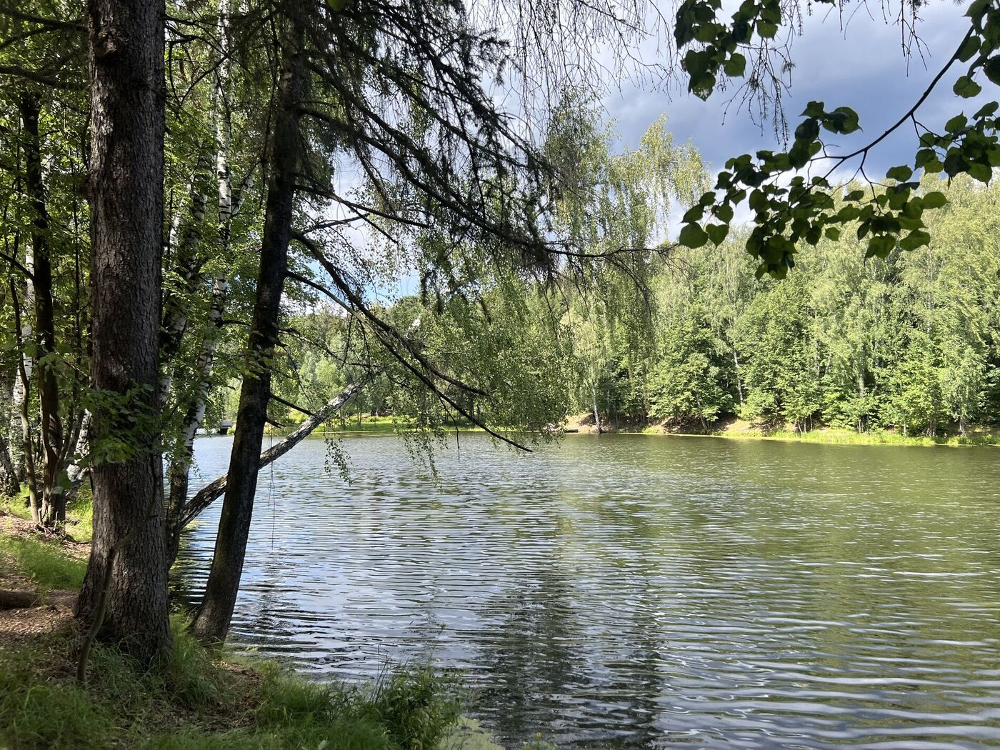

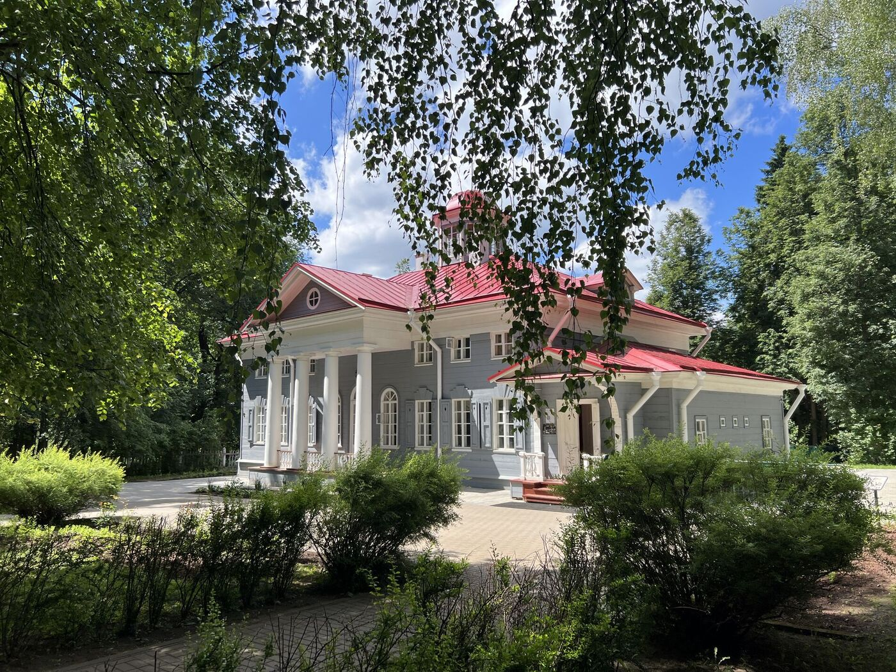

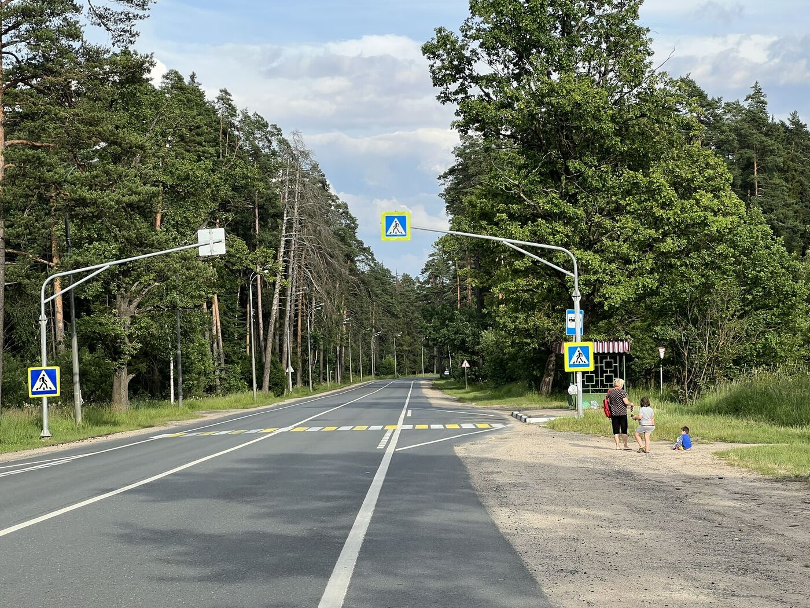

## Звенигород

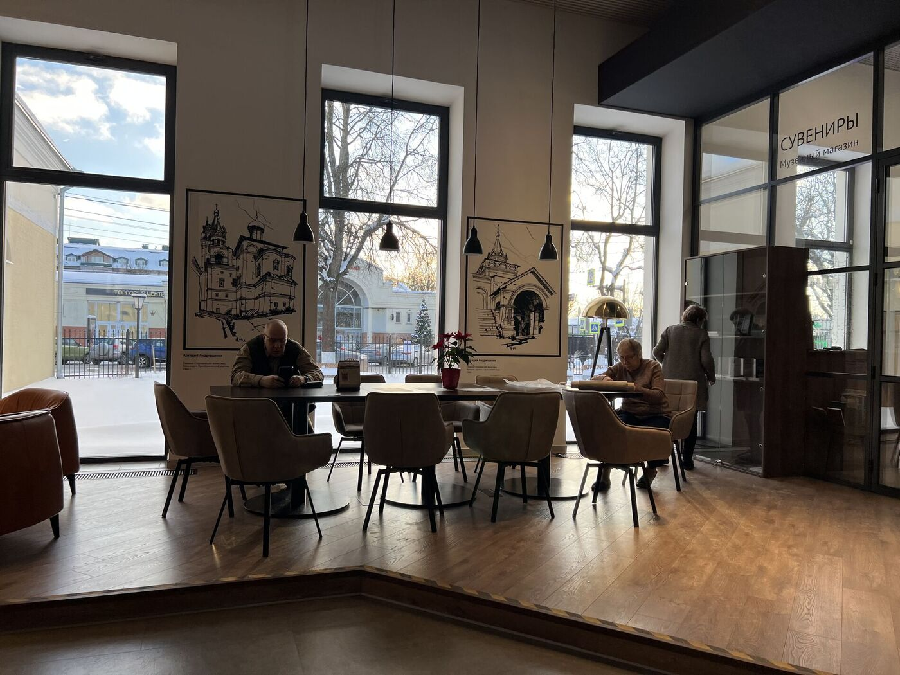

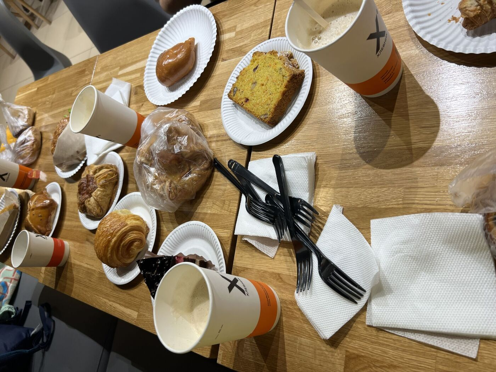

## Городок

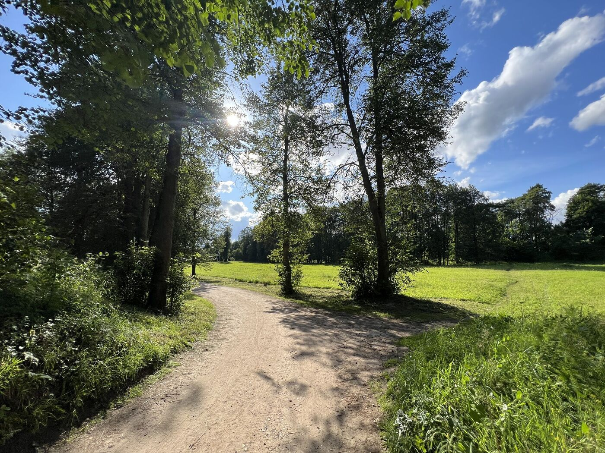

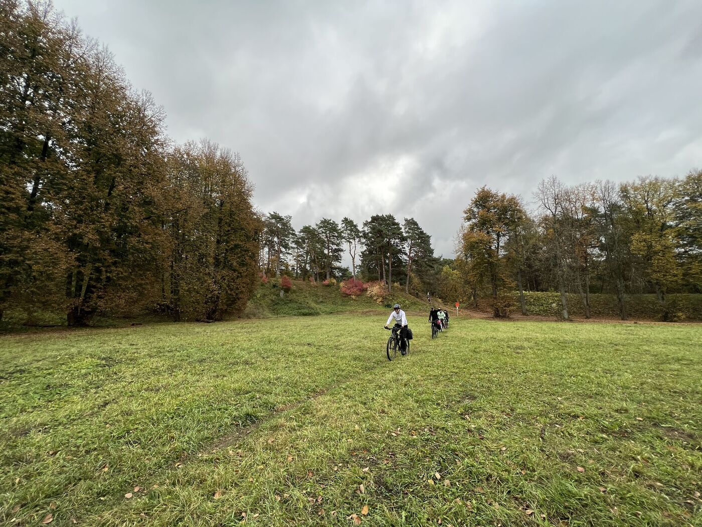

## Саввино-Сторожевский Монастырь

## Слобода и до станции Звенигород

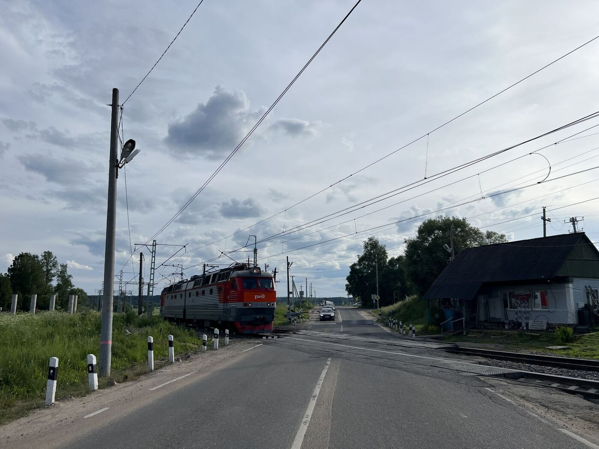

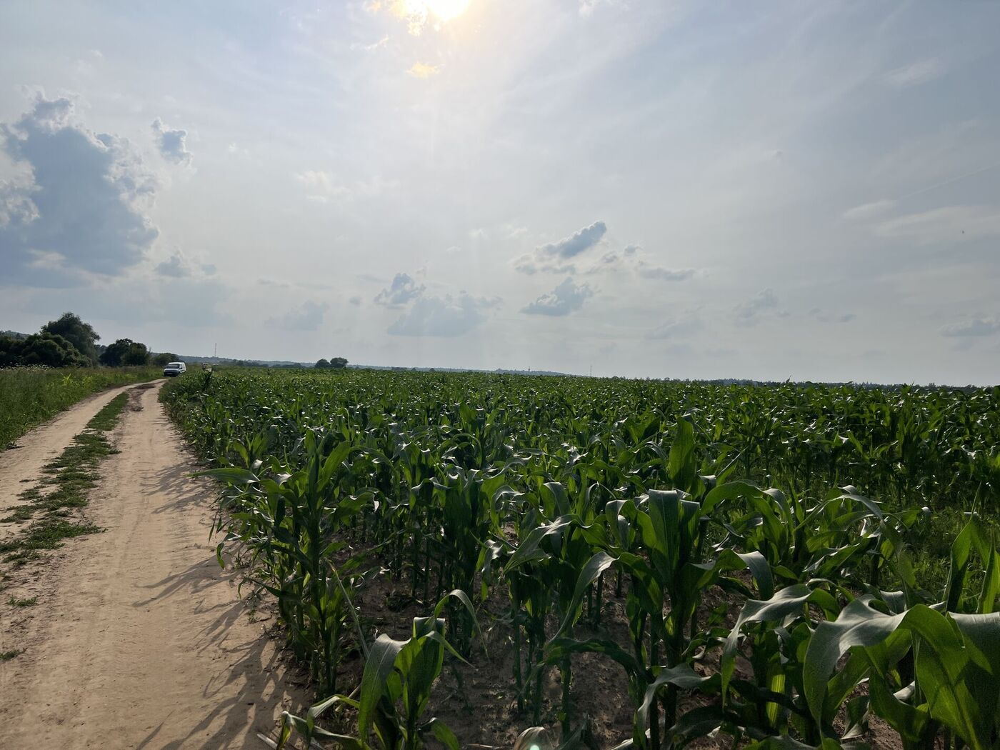

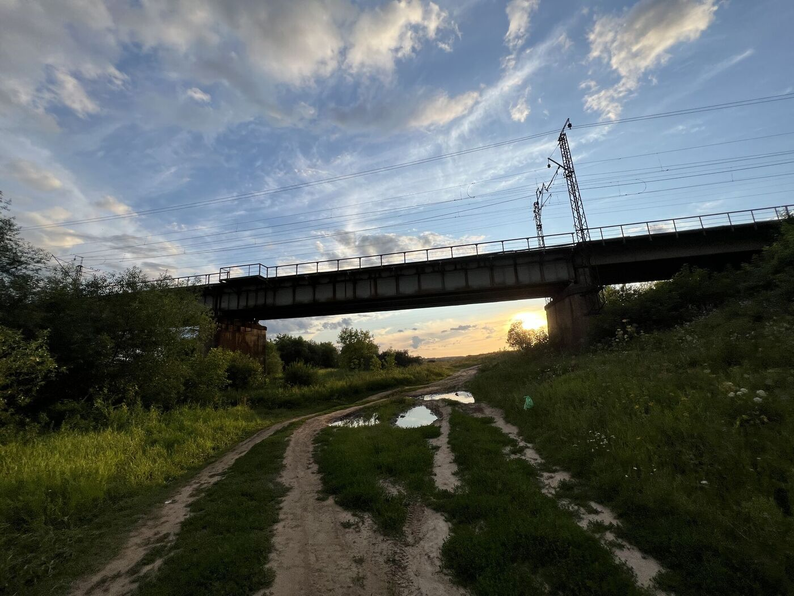

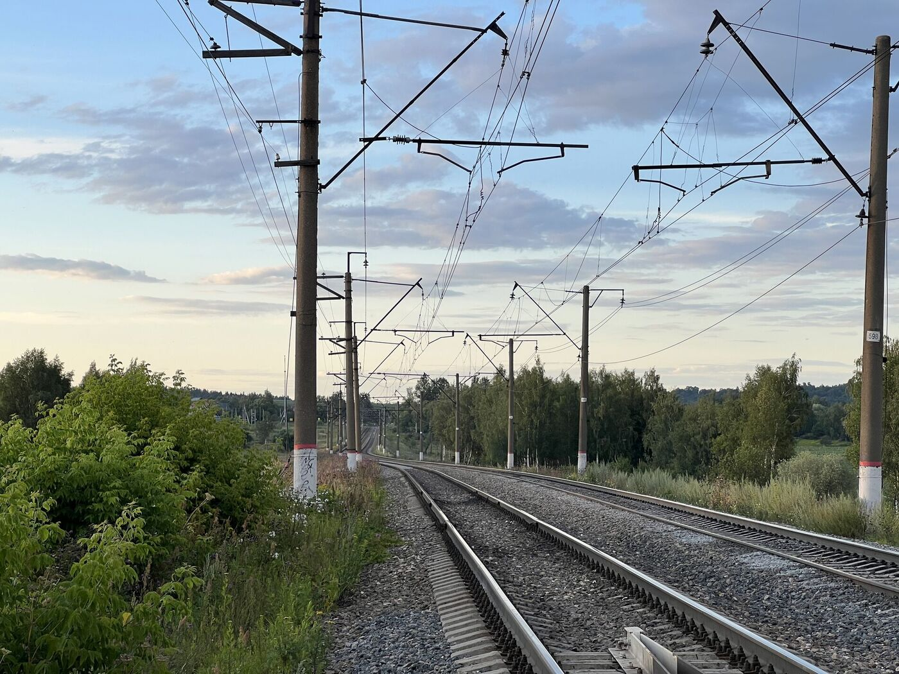

<link href="https://api.mapbox.com/mapbox-gl-js/v3.10.0/mapbox-gl.css" rel="stylesheet">

