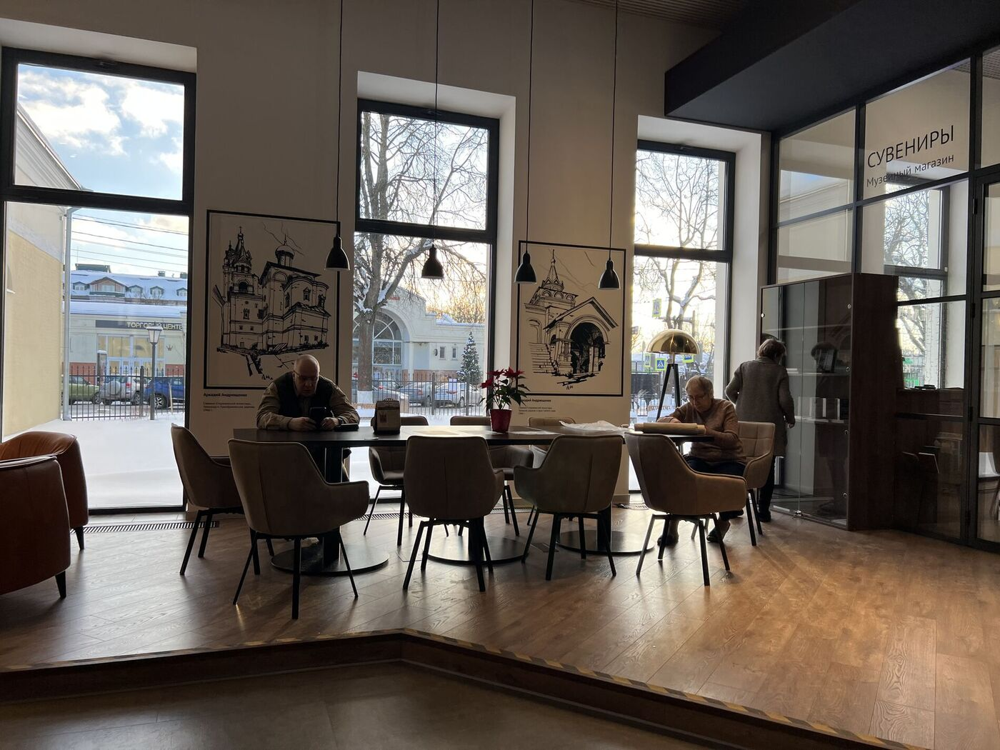

<link rel="stylesheet" href="../assets-custom/css/style-markdown.css">

	

		

            Вяземы, Захарово, Звенигород
        

		

			

                
                Пешком
            

            

                
                1 день
            

		

	

## Станция Голицыно

## Усадьба Вяземы

## Усадьба Захарово

## Звенигород

## Городок

## Саввино-Сторожевский Монастырь

## К станции Звенигород

# LAST ---->

Исторический и живописный веломаршрут недалеко от Москвы (примерно 40 км от города).
Идеально для поездки на выходных — в субботу или воскресенье.

Общее описание маршрута
•	Старт: Белорусский вокзал → Голицыно (электричка)
•	Веломаршрут: Голицыно → Вязёмы → Захарово → Звенигород
•	Общая протяжённость веломаршрута: 40-50 км (в зависимости от ответвлений)

**1. Усадьба Вязёмы**

Старинная усадьба, принадлежавшая князьям Голицыным.
Что посмотреть:
•	Церковь Преображения конца XVI века
•	Исторические здания усадьбы
•	Парк и пруды
Ссылка на Google Maps:
https://goo.gl/maps/7HpRVPSPdD52

**2. Усадьба Захарово**

Усадьба бабушки Александра Сергеевича Пушкина, где он проводил детские летние каникулы.
Что посмотреть:
•	Дом-музей Пушкина
•	Парковая зона и прогулочные тропы
Ссылка на Google Maps:
https://goo.gl/maps/ZTNT13RDaKt

**3. Город Звенигород**

Один из древнейших городов Подмосковья, основан в XII веке.
Что посмотреть:
•	Саввино-Сторожевский монастырь, основанный в 1398 году
•	Успенский собор с фресками Андрея Рублёва
Ссылка на монастырь в Google Maps:
https://goo.gl/maps/h3yBR6EFSVt

Природа и пейзажи
•	Лесные дорожки, поля и виды на реку
•	Возможность купания в Москве-реке
•	Сосновые леса и свежий воздух в районе Звенигорода

Еда и отдых
•	В Звенигороде есть кафе и рестораны с традиционной русской кухней
•	Или можно взять еду с собой и устроить пикник в парке или на берегу реки

Возвращение
•	Станция Звенигород → Белорусский вокзал (примерно 1 час в пути)
•	Электрички ходят каждые 30-60 минут

<link href="https://api.mapbox.com/mapbox-gl-js/v3.10.0/mapbox-gl.css" rel="stylesheet">

