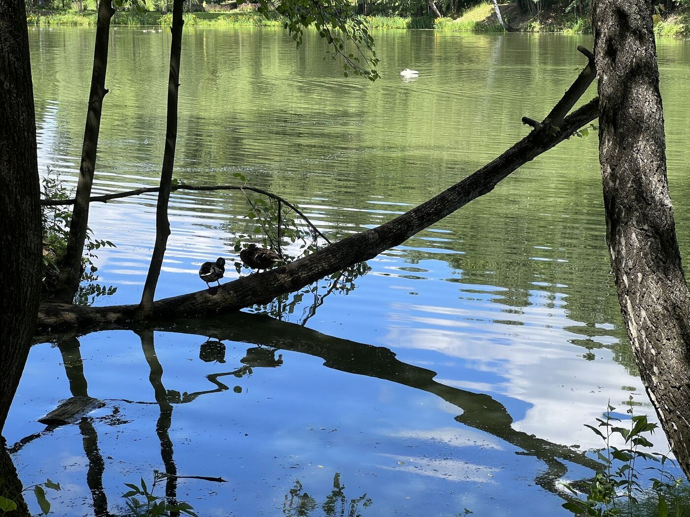
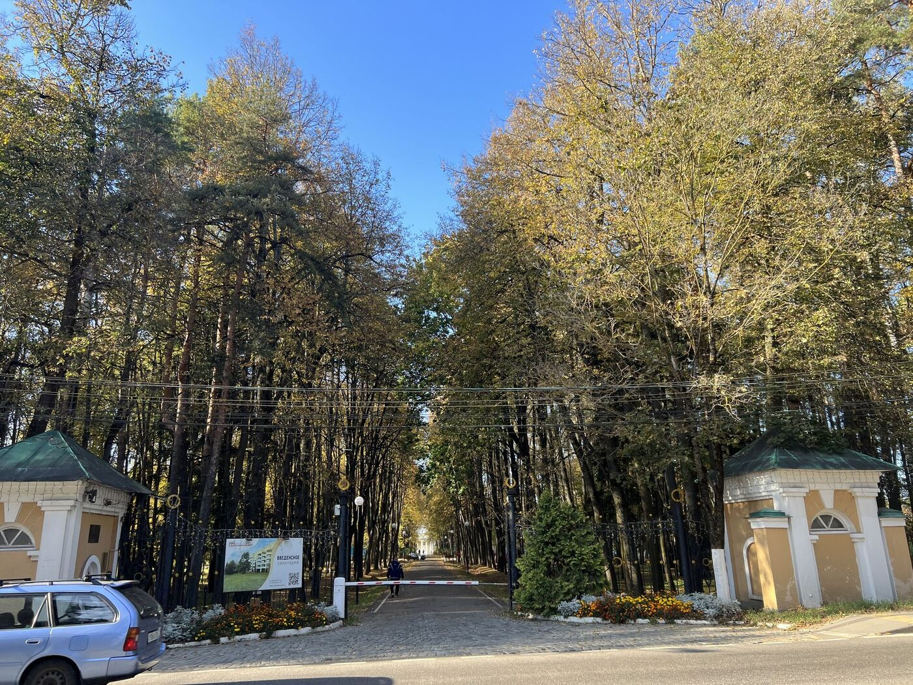
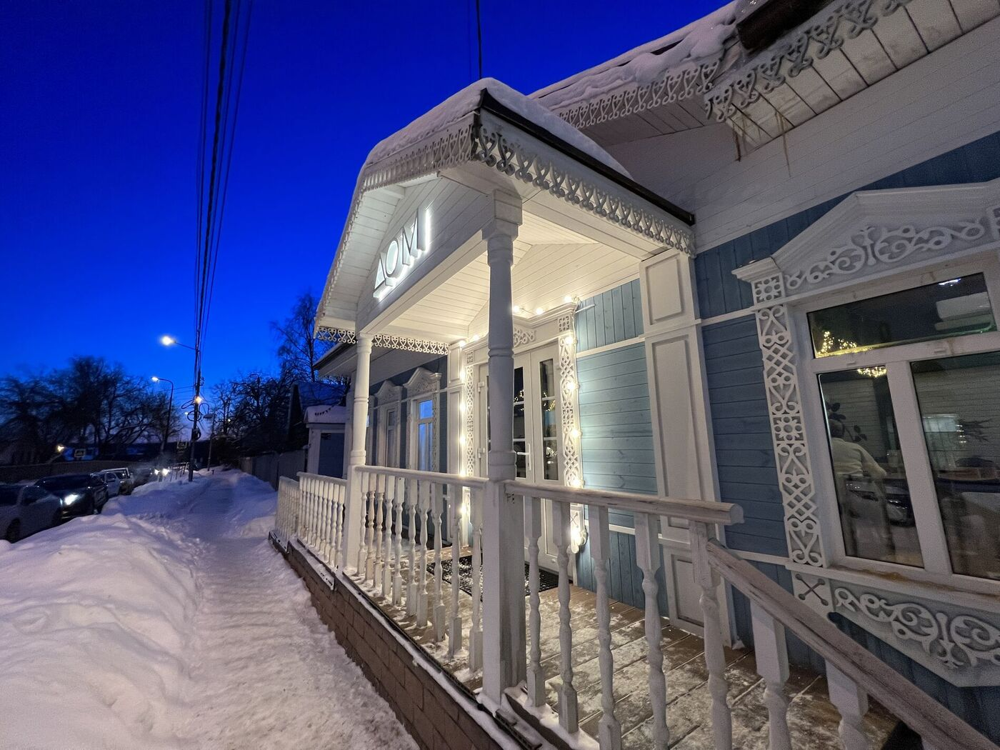
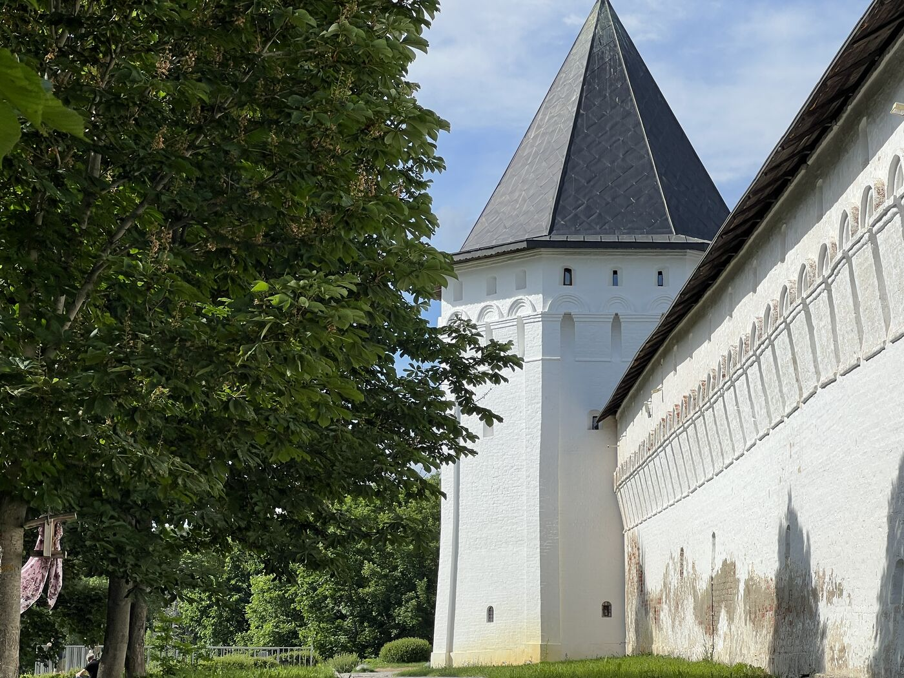

<link rel="stylesheet" href="../assets-custom/css/style-markdown.css">

	

		

            Вяземы, Захарово, Звенигород
        

		

			

                
                Пешком
            

            

                
                1 день
            

		

	

## Станция Голицыно

## Усадьба Вяземы

Большие Вяземы — уголок старой Руси, спрятанный среди подмосковных перелесков, где время будто замедляется. Здесь всё словно застыло в ожидании: и строгий силуэт храма XVI века, и тень от звонницы, и отражение пруда, давно знакомого князьям, полководцам и поэтам.

Когда-то эта земля принадлежала Борису Годунову, и именно он превратил Вяземы в образцовую резиденцию. В 1598 году здесь был возведён каменный храм Преображения Господня — суровый и величественный. Его форма отказалась от шатровой моды, вернувшись к строгой четырёхстолпной архитектуре с пятью главами. Два придела, гульбище и высокий подклет образуют гармоничный ансамбль, определивший новый стиль — «годуновский».

Неподалёку возвышается звонница — редчайший памятник XVI века, единственный в своём роде на всём Подмосковье.

Церковь и звонницу можно свободно посетить. Рядом с храмом вход в парк и усадьбу Голицыных — билет на вход стоит всего 50 рублей. Здесь, среди аллей и старых деревьев, легко представить экипажи с гостями, мимо которых проносились всадники со столичных ямов.

Усадебный дом, выстроенный в XVIII веке, открыт для посетителей: там проходят временные выставки, посвящённые жизни усадьбы, её обитателям и эпохе. Интерьеры — скромные, но полны стиля и света.

За века Вяземы видели многое: польские отряды и французские марши, Кутузова и Наполеона, светскую музыку и шёпот монахов. Здесь останавливались иноземные послы, устраивались «ледяные сражения» времён Лжедмитрия, а над старым валом звучали польские и латинские слова, выцарапанные на стенах.

## Усадьба Захарово

Захарово — усадьба, где родилась поэзия. Здесь, на границе полей и дубрав, всего в часе езды от Москвы, в «смиренном уголке, с которым роскошь незнакома» маленький Саша Пушкин впервые почувствовал, что значит быть свободным.

Сюда, к бабушке Марии Алексеевне Ганнибал, он приезжал каждое лето с шестилетнего возраста. Она купила усадьбу в 1804 году — маленькую деревню с семью десятками душ, прудом и дубами, растущими у самого дома. Пушкин вспоминал:

> _«Мне видится мое селенье,  
Мое Захарово; оно 
С заборами в реке волнистой,  
С мостом и рощею тенистой  
Зерцалом вод отражено…»_ 

Сначала это был угрюмый, молчаливый мальчик, но в деревне он оживал. Гулял по рощам, носился по лугам, как богатырь, размахивая палкой вместо меча, и сочинял стихи. Сосны, берёзы, липы, ручьи и пыльные тропинки — всё это стало его школой, его первым вдохновением.

> _«Туда зарею поспешаю. 
С смиренным заступом в руках,  
В лугах тропинку извиваю,  
Тюльпан и розу поливаю —  
И счастлив в утренних трудах…»._ 

Любимая берёзовая роща подступала тогда прямо к дому. Среди этих деревьев, как писали современники, мальчик мечтал быть похороненным. На берегу пруда росла огромная липа — «пушкинская» — а рядом, по преданию, он оставил строки на коре берёз. От них остались лишь следы букв…

Сегодня в Захарове воссоздан тот самый деревянный домик — с балконом, откуда маленький поэт мог сходить прямо в «весёлый сад», где цвели и Флора, и Помона. Интерьеры восстановлены с трепетом: красное дерево, зеркала, книжные полки, комната няни — всё напоминает о детстве, прожитом не зря.

> _«Мой тесный домик, рощи темны,  
Калитку, садик, ближний пруд,  
И снова я, философ скромный,  
Укрылся в милый мне приют…»._ 

В музее сегодня проходят экскурсии, выставки, детские программы. Здесь можно не только увидеть дом, но и почувствовать его — сесть на скамью у липы, пройти к пруду, услышать голос природы, который вдохновлял Пушкина.

Сюда легко доехать: электричкой до платформы Школьная, а дальше — пешком 10 минут. Вход на территорию свободный, музей открыт для всех, кто хочет прикоснуться к живому корню поэзии. Рядом — Большие Вяземы, куда Пушкин ходил с няней Аришей или дядькой Никитой — по лесной дороге, той самой, что и сегодня ведёт через ручей и тень дубрав.

> _«Нет, в рощи я ленивца приглашу:  
Друзья мои, как утро здесь прекрасно!  
В тиши полей, сквозь тайну сень дубрав.  
Как юный день сияет гордо, ясно!»_   

Захарово — не музей. Это — память, ставшая пространством. Здесь звучат стихи не с подмостков, а с листьев и воды. Здесь можно не читать Пушкина, а просто слышать его.

## Введенское по пути

Почти никто не говорит об этой усадьбе. Её не показывают в туристических буклетах, не включают в автобусные маршруты. Она скрыта — за шлагбаумом, за деревьями, за новой станцией Звенигород. Но если знать, куда смотреть, то можно уловить отблеск — белый портик, колоннаду, изгиб аллеи, лёгкую тоску по забытому величию. Это — Введенское.

Сейчас здесь санаторий. Всё огорожено, закрыто, под охраной. Но когда-то это было место светлой архитектурной мечты. Усадьба, созданная не чиновником, не мастером из модной школы, а человеком редчайшей эпохи — Николаем Львовым, архитектором и поэтом, собирателем песен и проектировщиком водолечебниц, рисовальщиком, издателем летописей. Львов сам ходил по холмам Введенского, сам мёрз в поле, выбирая точку для господского дома, сам нанёс на план тропы и посадки.

> «Натура в этом месте всё сделала.   
Но оставила художнику урок изрядный…» — писал он.

Введенское было усадьбой-откровением. Дом — двухэтажный, но с достоинством дворца. Белые колонны, мягкие линии, просвет к пойме, где внизу течёт река. Вид на холмы, на златоглавый собор вдали. Легкость композиции, пейзажность — в противовес регулярным садам типа Архангельского. Здесь всё про воздух и свет, про ощущение и пространство.

Со временем многое изменилось. Деревянные корпуса заменили кирпичными, восстановили залы, перестроили галереи. Добавили второй этаж, заменили колоннады верандами. Но главное — не исчезло. Всё ещё можно узнать силуэт, уловить замысел. Всё ещё можно почувствовать — как это было задумано: не как резиденция, а как тихое совершенство.

Усадьбой владели Голицыны, Лопухины, Шереметевы. Здесь жила художница М.В. Якунчикова, писавшая с этих окон «Из старого дома» — вид, который в точности повторяет реальность и сегодня. Здесь вырос парк, созданный не по линейке, а по чувству. Липы, берёзы, рощи, аллеи, тропинки, открывающиеся то к реке, то к полю, то к дому.

После революции — детский дом, потом учебные мастерские, позже санаторий. Современный корпус — резкий, угловатый, но он пытается уважительно вписаться в этот пейзаж, не разрушая его окончательно.

Сегодня Введенское — один из тех уголков, который хочется не увидеть, а угадать. Он требует внимания и тишины. Это место, где старое ещё живо, пусть и под стеклом нового фасада. Усадьба для тех, кто умеет смотреть сквозь — сквозь время, сквозь ограду, сквозь суету.

Если вы по пути в Звенигород, не спешите.
Сойдите на станции. Пройдите чуть в сторону.
Оглянитесь. Возможно, вы поймаете взглядом то самое:
усадьбу, где всё создано с любовью — и потому не исчезает.

## Звенигород

1

2

## Выставочный центр - Манеж

Манеж в Звенигороде — это культурное пространство, где гармонично сочетаются история, искусство и современный комфорт. Он включает два выставочных зала: один для постоянной мультимедийной экспозиции, посвящённой истории города, другой — для временных выставок, организованных в партнёрстве с Русским музеем.

Среди прошедших выставок — «Вокруг Левитана» и «Преображённая природа», которые познакомили зрителей с произведениями таких мастеров, как Айвазовский, Саврасов, Куинджи, Репин, Поленов, Коровин, Грабарь и Васнецов.

В манеже также есть уютный кафетерий с живописным видом на город и магазин, где можно приобрести книги о истории Звенигорода и русской художественной культуре, а также уникальные сувениры.

Таким образом, Манеж стал не только культурным центром Звенигорода, но и важным местом для тех, кто ценит искусство и атмосферу уюта.

## Малиновый овраг

Малиновый овраг в Звенигороде, ранее известный как Америка, — это живописная тропа, проходящая через крутые холмы, где в жаркие дни всегда царит прохлада. Овраг ведёт к холмистому Городку и Успенскому собору, создавая идеальный маршрут для пеших прогулок.

Здесь, кроме знаменитого дуба Чехова, под которым писатель любил отдыхать, расположен и дом-больница, в котором он работал. Именно здесь Чехов черпал вдохновение для своих рассказов, многие из которых связаны с этим местом. Малиновый овраг — это уникальная возможность прикоснуться к истории и литературному наследию Звенигорода.

## Городок

## Саввино-Сторожевский Монастырь

## К станции Звенигород

<link href="https://api.mapbox.com/mapbox-gl-js/v3.10.0/mapbox-gl.css" rel="stylesheet">

