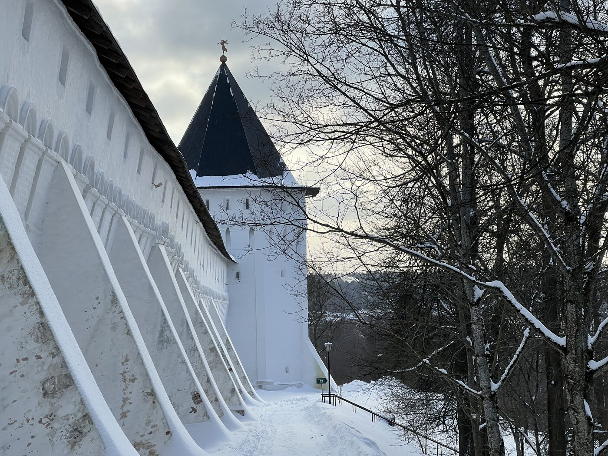

<meta property="og:title" content="Звенигород">
<meta property="og:description" content="Пешком по городу">
<meta property="og:image" content="https://andrewalevin.github.io/journeys/zvenigorod/zvenigorod-rozgd.jpg">

<link rel="stylesheet" href="../assets-custom/css/style-markdown.css">

	

		
Звенигород

		

			

                
                Пешком
            

            

                
                1 день
            

		

	

## Прекрасный Звенигород

## Введенское по пути

Введенское — это не место, в которое заезжают случайно. Его нужно искать взглядом — с платформы, из окна электрички, из-за деревьев, что окружают его высокими стенами тишины. И если вы увидите колонны над кронами, белый фронтон сквозь листву — знайте: вы рядом с одним из самых изящных и недооценённых архитектурных ансамблей Подмосковья.

Сегодня здесь санаторий, и попасть внутрь трудно. Но когда-то Введенское считалось одним из лучших загородных имений России, и сам архитектор Николай Львов — тот самый, что писал басни, строил дворцы, собирал народные песни и добывал каменный уголь — замерз на морозе, осматривая будущую постройку, не в силах оторваться от окружающего пейзажа.

> «Место сие, — писал он владельцу, — лучшее из подмосковных…»

Введенское строилось в конце XVIII века для фаворитки императора Павла I. Но дух этого места — не царский и не помпезный, а тихий, ясный, продуманный. Дом всего в два этажа, без излишеств, но каждый его элемент подчинён гармонии. Белые колонны, гладкие стены, лёгкий изгиб боковых флигелей, галереи и лоджии — всё словно струится по рельефу, сливается с парком, с видом на долину Москвы-реки.

Пейзаж вокруг — не случайность природы, а тонкое произведение садово-паркового искусства. Здесь нет строгих линий, но есть продуманный просвет к реке, рощи, посаженные кругами, липовые аллеи, что спускаются от парадного двора к пойме. Здесь снимали сцены «Войны и мира», и это был не декор, а реальность, совпавшая с вымыслом.

Введенское принадлежало многим: Голицыным, Шереметевым, Якунчиковым. Здесь писали картины, пели романсы, читали стихи, лечили детей, обучали ремеслам. Дочь известного промышленника М.В. Якунчикова писала здесь свои полотна — в том числе и «Из окон старого дома», где видна та самая колоннада. После 1917 года усадьба превратилась в детский дом, потом — в учебный центр, и, наконец, — в санаторий.

Теперь парадный двор оформлен в строгом регулярном стиле с фонтаном, а за господским домом возвышается корпус советской архитектуры с треугольными окнами и концертным залом-амфитеатром. Но даже сквозь современность слышен голос ушедшего века: поэтичный, спокойный, основательный.

Введенское не бросается в глаза. Оно раскрывается лишь тем, кто умеет замедлиться и посмотреть — чуть внимательнее, чуть дольше.

Как найти: на электричке до станции Звенигород — усадьба сразу за платформой, на высоком берегу. Войти внутрь сложно, но даже мимолётная встреча оставляет след. Это то место, о котором стоит помнить — даже если не удалось туда попасть.

### Манеж

## Выставочный центр - Манеж

Манеж в Звенигороде — современное музейное пространство, сочетающее искусство, культуру и комфорт. В нём два зала: один для постоянной мультимедийной экспозиции, посвящённой истории Звенигорода, другой — для временных выставок, организованных в сотрудничестве с Русским музеем.

В прошедшие годы здесь прошли выставки «Вокруг Левитана» и «Преображённая природа», на которых были представлены работы Айвазовского, Саврасова, Куинджи, Репина, Поленова, Коровина, Грабаря и Васнецова.

Уютный кафетерий с видом на город и тёплый магазин с книгами об истории Звенигорода, русской художественной культуре и уникальными сувенирами создают атмосферу гостеприимства и уюта.

Манеж стал важным культурным центром Звенигорода, гармонично объединяя современное искусство и историческое наследие.

## Малиновый овраг, дом чехова и путь к Городку

Малиновый овраг в Звенигороде — историческое место, когда-то называлось Америкой. Эта живописная тропа, проходящая через крутые холмы, в жаркие дни становится особенно прохладной и ведёт к холмистому Городку и Успенскому собору, создавая прекрасный маршрут для прогулок.

В этом районе находятся не только знаменитый дуб Чехова, под которым писатель любил отдыхать, но и дом-больница, в которой Чехов работал. Здесь он черпал вдохновение для своих рассказов, многие из которых связаны с этим местом. Прогулка по Малиновому оврагу — это путешествие по страницам истории и литературы, которое даёт возможность увидеть важные для Чехова и Звенигорода памятники.

## Городок

## Саввино-Сторожевский Монастырь

# LAST ------>

Исторический и живописный веломаршрут недалеко от Москвы (примерно 40 км от города).
Идеально для поездки на выходных — в субботу или воскресенье.

Общее описание маршрута
•	Старт: Белорусский вокзал → Голицыно (электричка)
•	Веломаршрут: Голицыно → Вязёмы → Захарово → Звенигород
•	Общая протяжённость веломаршрута: 40-50 км (в зависимости от ответвлений)

**1. Усадьба Вязёмы**

Старинная усадьба, принадлежавшая князьям Голицыным.
Что посмотреть:
•	Церковь Преображения конца XVI века
•	Исторические здания усадьбы
•	Парк и пруды
Ссылка на Google Maps:
https://goo.gl/maps/7HpRVPSPdD52

**2. Усадьба Захарово**

Усадьба бабушки Александра Сергеевича Пушкина, где он проводил детские летние каникулы.
Что посмотреть:
•	Дом-музей Пушкина
•	Парковая зона и прогулочные тропы
Ссылка на Google Maps:
https://goo.gl/maps/ZTNT13RDaKt

**3. Город Звенигород**

Один из древнейших городов Подмосковья, основан в XII веке.
Что посмотреть:
•	Саввино-Сторожевский монастырь, основанный в 1398 году
•	Успенский собор с фресками Андрея Рублёва
Ссылка на монастырь в Google Maps:
https://goo.gl/maps/h3yBR6EFSVt

Природа и пейзажи
•	Лесные дорожки, поля и виды на реку
•	Возможность купания в Москве-реке
•	Сосновые леса и свежий воздух в районе Звенигорода

Еда и отдых
•	В Звенигороде есть кафе и рестораны с традиционной русской кухней
•	Или можно взять еду с собой и устроить пикник в парке или на берегу реки

Возвращение
•	Станция Звенигород → Белорусский вокзал (примерно 1 час в пути)
•	Электрички ходят каждые 30-60 минут

<link href="https://api.mapbox.com/mapbox-gl-js/v3.10.0/mapbox-gl.css" rel="stylesheet">

